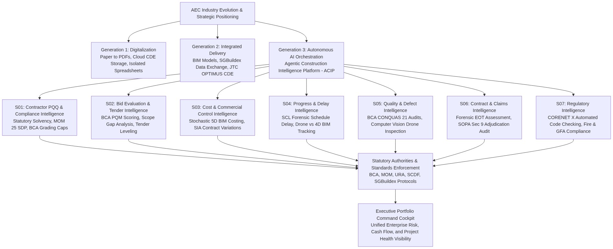
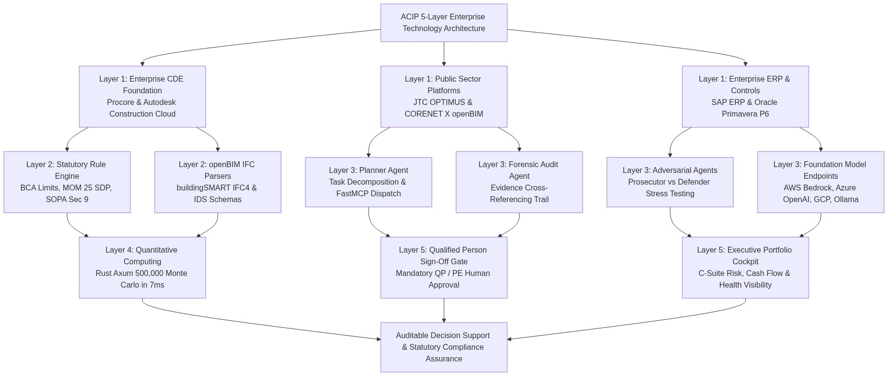

# <span style="color:red">🏗️ Agentic Construction Intelligence Platform (ACIP)</span>

- **Go to Business Problem Statement & Case Studies:** [S01](./S01_Agentic_Contractor_PQQ_And_Compliance_Intelligence/BUSINESS_PROBLEM_STATEMENT.md), [S02](./S02_Agentic_Bid_Evaluation_And_Tender_Intelligence/BUSINESS_PROBLEM_STATEMENT.md)
- **Go to Implementation Guide & Technical Runbook:** [S01](./S01_Agentic_Contractor_PQQ_And_Compliance_Intelligence/README.md), [S02](./S02_Agentic_Bid_Evaluation_And_Tender_Intelligence/README.md)

---

## <span id="executive-summary"></span><span style="color:red">⚡ Executive Summary</span>

The Architecture, Engineering, and Construction (AEC) sector represents over S$35 billion in annual projected construction demand in Singapore (as projected by the Building and Construction Authority, BCA) and represents one of the largest global engines of capital deployment. However, the industry remains burdened by structural fragmentation, paper-based administrative friction, and high-stakes financial vulnerability.

The **Agentic Construction Intelligence Platform (ACIP)** is an open reference architecture exploring assistive multi-agent decision-support workflows for the built environment. By coupling open standards, deterministic statutory guardrails, the open **Model Context Protocol (MCP)** (implemented using the FastMCP framework), and quantitative risk simulation, ACIP assists project teams, quantity surveyors, and statutory officers in conducting rapid, verifiable due diligence alongside existing enterprise systems of record.

### ⚠️ Core Business & Commercial Challenges

Construction enterprises and institutional developers operate under razor-thin operating margins (historically between 2% and 5%), making them acutely vulnerable to systemic shocks.

Some of the challenges which Construction enterprises face are:

- **Main Contractor Insolvency & Continuity Risk**: The liquidation of premier Grade A1 contractors (exemplified by the August 2021 Greatearth liquidation halting five major Singapore public housing developments) reveals that statutory registration tiers alone do not guarantee real-time cash flow viability.
- **Workplace Safety Demerit Halts**: Under Singapore Ministry of Manpower (MOM) regulations, accumulating 25 Safety Demerit Points (SDP) triggers a mandatory debarment freezing foreign worker recruitment, disrupting site manpower and project schedules.
- **Subcontractor Payment Chokeholds**: Non-compliant "Pay-When-Paid" provisions continue to be inserted into subcontracts despite being rendered unenforceable and of no effect under Section 9 of the Singapore Building and Construction Industry Security of Payment Act (SOPA). Such clauses starve trade subcontractors of working capital and trigger supply-chain statutory adjudications.
- **Commodity & Macro Volatility**: Rapid inflation in reinforcing rebar, structural steel, ready-mixed concrete, and foreign worker levy hikes quickly invert fixed-price lump-sum contracts into severe operating deficits.

### 🌐 Alignment with National Initiatives & Industry Standards

#### 🇸🇬 Singapore Public Sector & Regulatory Initiatives

Currently, we understand the Singapore government is spearheading the following initiatives to improve productivity and digitalisation in the built environment industry. These are:

- **JTC OPTIMUS & IDDTA (Integrated Digital Delivery Technology Alliance)**: JTC's benchmark Connected Data Environment (CDE) supporting national industrial infrastructure. In 2026, JTC onboarded specialized technology providers across precast logistics, reality capture, and aerial defect inspection. ACIP serves as an intelligent reasoning and audit layer interfacing with connected data environments.
- **BCA Integrated Digital Delivery (IDD) Framework**: BCA's 4-stage digital lifecycle model: Digital Design -> Digital Fabrication -> Digital Construction -> Digital Asset Delivery. ACIP modules map to these key lifecycle stages.
- **CORENET X**: Singapore's unified regulatory submission portal transitioning the industry to coordinated openBIM (IFC+SG) submissions across statutory authorities (BCA, URA, SCDF, PUB, LTA, NEA, NParks). ACIP S07 is designed to provide pre-submission model checking to reduce regulatory submission errors.
- **SGBuildex**: BCA and IMDA's federated data-exchange standard connecting developers, contractors, testing laboratories, and statutory bodies via standardized APIs.
- **BCA Built Environment Industry Transformation Map (ITM)**: National transformation roadmap advancing digital procurement, collaborative contracting, and automated quality assurance across the built environment lifecycle.

#### 🌍 Global Commercial Platforms

In addition, we have also researched some of the leading commercial platforms in the built environment industry. These are:

- **Procore**: Global leader in construction SaaS covering preconstruction, financials, and project execution, increasingly incorporating AI-assisted document and workflow tools.
- **Autodesk Forma & Autodesk Construction Cloud (ACC)**: Cloud platform unifying BIM authoring (Revit) with field management (Construction IQ) and experimental openBIM MCP integrations.
- **Oracle Construction & Engineering**: Industry-standard Primavera P6 for critical-path scheduling, Textura for payment management, and Oracle Construction Intelligence Cloud for predictive delay risk.
- **Bentley Systems**: Pioneer of infrastructure digital twins (iTwin) powering civil infrastructure, rail, and utilities.

Grounded in these national frameworks and industry platforms, ACIP does not seek to replace existing systems of record. Instead, we designed ACIP to align closely with the industry's digital roadmap while introducing practical, platform-wide enhancements: moving beyond passive data repositories to proactive multi-agent decision support, enforcing deterministic statutory guardrails outside the generative model path to prevent mathematical and compliance hallucinations, and delivering transparent, verifiable evidence trails that assist licensed human professionals at every stage of the capital asset lifecycle.

In the sections that follow, we dive deeper into the ACIP architecture and explore the implementation details of its core components.

---

## <span id="toc"></span>📑 Table Of Contents (TOC)

- [1. ACIP System Architecture](#acip-architecture)
  - [1.1 Business Architecture & Asset Lifecycle Coverage](#business-architecture)
  - [1.2 Technology Architecture & Multi-Layer Stack](#technology-architecture)
- [2. Enterprise Governance & Human-in-the-Loop Protocol](#governance)
  - [2.1 Decision-Support & Audit-Assist Boundary](#audit-boundary)
  - [2.2 Deterministic Execution Boundary for Statutory Calculations](#deterministic-boundary)
  - [2.3 Enterprise Data Sovereignty & Confidentiality](#data-sovereignty)
- [3. Modular ACIP Portfolio & Implementation Roadmap (S01 to S07)](#portfolio-roadmap)
  - [3.0 ACIP Architectural Control Plane & Authority Matrix](#control-plane)
  - [3.1 S01: Agentic Contractor PQQ & Compliance Intelligence (Active Reference Implementation)](#s01-pqq)
  - [3.2 S02: Agentic Bid Evaluation & Tender Intelligence (Active Reference Implementation)](#s02-tender)
  - [3.3 S03: Agentic Cost & Commercial Control Intelligence (Planned)](#s03-cost)
  - [3.4 S04: Agentic Progress & Delay Intelligence (Planned)](#s04-progress)
  - [3.5 S05: Agentic Quality & Defect Intelligence (Planned)](#s05-quality)
  - [3.6 S06: Agentic Contract & Claims Intelligence (Planned)](#s06-claims)
  - [3.7 S07: Agentic Regulatory & Code Intelligence (Planned)](#s07-regulatory)
- [4. Frequently Asked Questions (FAQ)](FAQ.md)
- [5. Project Execution, Velocity & Delivery Playbook](DELIVERY_PLAYBOOK_AND_METRICS.md)
- [6. Open Source Governance & Licensing](#licensing)

---

## <span id="acip-architecture"></span><span style="color:red">🏛️ 1. ACIP System Architecture</span> <span style="font-size: 14px; font-weight: normal;">[⬆️ Back to TOC](#toc)</span>

To realize our vision of assistive intelligence, we have structured the ACIP platform into two complementary architectural views:

- The **Business Architecture**, which illustrates how our specialized modules align with each stage of the capital project lifecycle and interface with statutory enforcement agencies.
- The **Technology Architecture**, which details the 5-layer engineering stack and safety guardrails that power these modules.

---

### <span id="business-architecture"></span>🏢 1.1 Business Architecture & Asset Lifecycle Coverage <span style="font-size: 14px; font-weight: normal;">[⬆️ Back to TOC](#toc)</span>

When we examine a typical capital project in Singapore, the lifecycle progresses across multiple distinct phases—from early contractor pre-qualification and tender evaluation, through cost control and site progress tracking, to quality audits, claims adjudication, and regulatory submissions.

To support project teams and public officers at each juncture, we structured ACIP into seven specialized modules (S01 through S07). Each module assists with specific statutory checks (such as BCA tendering limits, MOM safety demerit points, and SOPA compliance) before rolling up into an executive command cockpit for portfolio-level visibility:



---

### <span id="technology-architecture"></span>💻 1.2 Technology Architecture & Multi-Layer Stack <span style="font-size: 14px; font-weight: normal;">[⬆️ Back to TOC](#toc)</span>

From a technical standpoint, building an enterprise-grade AI system for the built environment requires strict reliability, auditability, and safety.

Rather than deploying an opaque, monolithic model, we designed ACIP around a clean, 5-layer decoupled architecture:

- **Layer 1 (Enterprise Data & CDE Foundation)**: Architectural design intent interfaces with existing systems of record—such as Procore, Autodesk Construction Cloud, JTC OPTIMUS, Primavera P6, SAP ERP, and CORENET X—preserving single-source-of-truth data integrity (with the S01 reference implementation operating against seeded SQLite registries).
- **Layer 2 (Model Context Protocol & Deterministic Guardrails)**: Standardizes tool interactions via typed MCP JSON-RPC interfaces, enforcing versioned statutory rules and financial calculations in deterministic Python and Rust engines to keep generative models entirely outside the authoritative computation path.
- **Layer 3 (Multi-Agent Cognitive Orchestration)**: Coordinates specialized agents (Planner, Forensic Auditor, and Adversarial Reviewers) across private clouds or sovereign on-premises LLM models.
- **Layer 4 (High-Performance Quantitative Computing)**: Employs a compiled Rust quantitative engine (with vectorized NumPy fallback) for high-throughput Monte Carlo risk stress-testing, generating scenario-based insolvency risk distributions. Rust was specifically chosen over Go and C++ because its strict compile-time ownership model and zero-cost abstractions deliver the deterministic execution rigor required for financial and risk modeling, operating without a tracing garbage collector (unlike Go) and eliminating concurrency data races (common in multithreaded C++).
- **Layer 5 (Human-in-the-Loop Governance & Role-Based Cockpits)**: Delivers clear, evidence-backed dashboards where licensed Qualified Persons (QPs), Professional Engineers (PEs), professional Quantity Surveyors, and Commercial Directors hold mandatory sign-off authority.



---

## <span id="governance"></span><span style="color:red">⚖️ 2. Enterprise Governance & Human-in-the-Loop Protocol</span> <span style="font-size: 14px; font-weight: normal;">[⬆️ Back to TOC](#toc)</span>

ACIP is governed by three non-negotiable enterprise protocols:

### <span id="audit-boundary"></span>🛡️ 2.1 Decision-Support & Audit-Assist Boundary <span style="font-size: 14px; font-weight: normal;">[⬆️ Back to TOC](#toc)</span>
- **Decision-Support, Not Final Authority**: ACIP provides evidence dossiers, deterministic calculations, and risk evaluations. 
- **Professional Sign-Off Gate**: All final pre-qualification selections, tender awards, payment certifications, statutory submissions, and legal notices strictly require **human-in-the-loop review and professional sign-off** from the applicable registered professionals—such as licensed Qualified Persons (QPs) for building plans, Professional Engineers (PEs) for structural certifications, professional Quantity Surveyors (QS) for payment valuations, or authorized Commercial Directors.
- **Legal & Advisory Boundary**: Contractual and statutory analysis tools (S01, S06) provide research and audit-assist workflows only; they do not constitute formal legal advice or substitute for qualified legal counsel.
- **Pre-Submission QA Boundary**: openBIM model checks (S07) provide pre-submission quality assurance assistance and do not constitute official regulatory endorsement or replace registered QP/PE professional certifications.

### <span id="deterministic-boundary"></span>🔒 2.2 Deterministic Execution Boundary for Statutory Calculations <span style="font-size: 14px; font-weight: normal;">[⬆️ Back to TOC](#toc)</span>
- Generative foundation models are strictly forbidden from fabricating regulatory thresholds, guessing balance sheet figures, or executing arbitrary database mutations.
- All regulatory and mathematical evaluations (e.g. BCA CW01 tendering limits, MOM 25 SDP debarment thresholds, SOPA Section 11 payment response deadlines, and Section 9 pay-when-paid enforceability checks) are handled exclusively by deterministic code executed via typed Model Context Protocol (MCP) tools.
- An append-only audit trail records all evidence inputs, tool invocations, and deterministic outputs, ensuring every finding is fully traceable for professional review.

### <span id="data-sovereignty"></span>🔐 2.3 Enterprise Data Sovereignty & Confidentiality <span style="font-size: 14px; font-weight: normal;">[⬆️ Back to TOC](#toc)</span>
- All corporate tender documents, financial records, proprietary pricing models, and site inspection media remain strictly governed within private enterprise cloud tenants or air-gapped on-premises environments.
- Designed to support fully offline, zero-data-egress local operation where organizational security classifications or public infrastructure guidelines mandate complete isolation.

---

## <span id="portfolio-roadmap"></span><span style="color:red">🗺️ 3. Modular ACIP Portfolio & Implementation Roadmap (S01 to S07)</span> <span style="font-size: 14px; font-weight: normal;">[⬆️ Back to TOC](#toc)</span>

The ACIP modular portfolio spans seven specialized, interoperable modules covering the full capital projects lifecycle from pre-qualification through regulatory code approval and claims resolution:

```text
┌────────────────────────────────────────────────────────────────────────────────────────┐
│                    AGENTIC CONSTRUCTION INTELLIGENCE PLATFORM (ACIP)                   │
├──────────────┬─────────────────────────────────────┬───────────────────┬───────────────┤
│ Module Code  │ Platform Module Title               │ Primary Focus     │ Status        │
├──────────────┼─────────────────────────────────────┼───────────────────┼───────────────┤
│ S01          │ Contractor PQQ & Compliance Intel   │ Solvency & MOM    │ Reference Impl│
│ S02          │ Bid Evaluation & Tender Intel       │ PQM & Drill-Down  │ Reference Impl│
│ S03          │ Cost & Commercial Control Intel     │ 5D BIM & VOs      │ Planned       │
│ S04          │ Progress & Delay Intelligence       │ SCL Delay & 4D    │ Planned       │
│ S05          │ Quality & Defect Intelligence       │ CONQUAS Defect QA │ Planned       │
│ S06          │ Contract & Claims Intelligence      │ SOPA Defense & EOT│ Planned       │
│ S07          │ Regulatory & Code Intelligence      │ CORENET X openBIM │ Planned       │
└──────────────┴─────────────────────────────────────┴───────────────────┴───────────────┘
```

---

### <span id="control-plane"></span>🏛️ 3.0 ACIP Architectural Control Plane & Authority Matrix <span style="font-size: 14px; font-weight: normal;">[⬆️ Back to TOC](#toc)</span>

To maintain rigorous technical and legal defensibility across all seven modules, ACIP enforces a strict 5-layer separation of concerns matching our core Technology Stack (Section 1.2). The platform operates on a single governing principle:

**Governing Architectural Principle**: ACIP agents may recommend, explain, and orchestrate; they do not self-certify statutory compliance, determine contractual entitlement, issue professional opinions, or replace legally mandated professional authority.

```text
┌────────────────────────────────────────────────────────────────────────────────────────┐
│                         LAYER 5: HUMAN PROFESSIONAL AUTHORITY                          │
│          Tender Evaluation Board | Quantity Surveyor | Qualified Person (QP)           │
│              Professional Engineer (PE) | Project Planner | Legal Counsel              │
├────────────────────────────────────────────────────────────────────────────────────────┤
│                               ▲ Authoritative Sign-Off                                 │
├────────────────────────────────────────────────────────────────────────────────────────┤
│                 LAYER 4: HIGH-PERFORMANCE QUANTITATIVE COMPUTING                       │
│        Rust Monte Carlo Simulation Engine | Vectorized Risk Stress-Testing             │
│            Compiled Axum Micro-Services | Leptos WASM Client Acceleration              │
├────────────────────────────────────────────────────────────────────────────────────────┤
│                             ▲ Numerical Risk Distributions                             │
├────────────────────────────────────────────────────────────────────────────────────────┤
│                         LAYER 3: AGENTIC REASONING & SYNTHESIS                         │
│           LangGraph State Machines | LLM Reasoning Loops | FastMCP Clients             │
│         Evidence Synthesis | Blind-Spot Exploration | Cross-Document Reasoning         │
├────────────────────────────────────────────────────────────────────────────────────────┤
│                        ▲ Verifiable Findings & Tool Invocations                        │
├────────────────────────────────────────────────────────────────────────────────────────┤
│               LAYER 2: DETERMINISTIC MCP STATUTORY & LOGIC GUARDRAILS                  │
│             Pure deterministic, mathematically verified code modules:                  │
│          PQM Scoring | CPM Schedule Float | openBIM QTO | Statutory Deadlines          │
├────────────────────────────────────────────────────────────────────────────────────────┤
│                            ▲ Columnar Buffers & Query Feeds                            │
├────────────────────────────────────────────────────────────────────────────────────────┤
│                   LAYER 1: ENTERPRISE DATA & IMMUTABLE EVIDENCE                        │
│        DuckDB / Polars Parquet | SQLite Ledgers | IFC4 openBIM | Primavera XER         │
│          Site Inspection Media | Cryptographic SHA-256 Content Addressing              │
└────────────────────────────────────────────────────────────────────────────────────────┘
```

#### 🛡️ Cross-Module Authority & Execution Matrix

| Module | Deterministic & Quantitative Gates (Layers 2 & 4) | AI Proposes & Synthesizes (Layer 3) | Human Decides & Endorses (Layer 5) |
| :--- | :--- | :--- | :--- |
| **S01: PQQ & Compliance** | MOM SDP debarment limits, solvency ratios, Rust Monte Carlo | Risk hypotheses, adversarial debate synthesis | Tender Board qualification determination |
| **S02: Bid Evaluation** | Rate-leveling, ALT deviation vs median, PQM composite scores | Clarification letters, scope exclusion flags | Tender Board contract award recommendation |
| **S03: Cost & Commercial** | openBIM quantity takeoff, cost commitments ledger | VO entitlement clause identification, payment response dossiers | Quantity Surveyor (QS) interim payment certificate |
| **S04: Progress & Delay** | Critical path float, Time Impact Analysis (TIA) schedule variance | Contemporaneous delay narratives, event correlation | Planning Engineer & Project Manager delay determination |
| **S05: Quality & Defects** | Workmanship defect clustering, subcontractor risk trends | Bounding-box candidate defect triage, draft NCRs | Clerk-of-Works & Structural Engineer inspection sign-off |
| **S06: Contracts & Claims** | SOPA Section 11/15 statutory deadline calendars, time-bar tracking | Chronological evidence graphs, precedent case research | Legal Counsel & Claims Consultant dispute strategy |
| **S07: Regulatory Intel** | 3D spatial clearance vectors, travel distances, indicative GFA | Pre-submission clash triage, IDS XML verification | Qualified Person (QP) & Professional Engineer (PE) endorsement |

---

### <span id="s01-pqq"></span>🛡️ 3.1 S01: Agentic Contractor PQQ & Compliance Intelligence (Active Reference Implementation) <span style="font-size: 14px; font-weight: normal;">[⬆️ Back to TOC](#toc)</span>

#### 🎯 Core Business Problem & Industry Risk

When public agencies and institutional developers award major capital contracts, procurement decisions carry long-term operational and financial consequences. Entrusting a development to a financially vulnerable or safety-compromised contractor risks project suspension, protracted delays, and costly retendering exercises.

Traditional pre-qualification audits often require four to eight weeks of manual evaluation across siloed portals and spreadsheets, and can struggle to surface three critical commercial vulnerabilities:

1. **Concealed Balance Sheet Distress**: High-tier statutory registration grades (such as BCA CW01 A1) certify historical track record, but they do not reflect real-time working capital volatility under sudden commodity and labor inflation shocks.
2. **Workplace Safety Demerit Halts**: Accumulated Ministry of Manpower (MOM) Safety Demerit Points (SDP) reaching the statutory 25-point threshold trigger an immediate debarment freezing foreign worker recruitment, disrupting site progress.
3. **Unenforceable Contractual Traps**: Non-compliant "Pay-When-Paid" provisions continue to surface in draft subcontracts despite being rendered unenforceable and of no effect under Section 9 of the Singapore Security of Payment Act (SOPA), triggering rapid supply-chain statutory adjudications and cash-flow bottlenecks that directly endanger project completion.

#### ⚡ Key Capabilities

To address these vulnerabilities, S01 operates as an assistive decision-support layer alongside existing procurement workflows. 

Rather than relying on ungrounded generative AI, the module deterministically verifies contractor registration workheads and financial grading limits against project budgets, audits active MOM demerit points against statutory debarment thresholds, and computes key balance sheet liquidity indicators (such as the Acid-Test ratio, Debt-to-Equity leverage, and estimated performance bond capacity). 

In addition, S01 scans contractual terms for statutory SOPA compliance and orchestrates an adversarial multi-agent review—pairing a Prosecutor Agent against a Defender Agent—to surface competing risk hypotheses and uncover latent blind spots. Rather than treating generative debate as authoritative evidence, the platform evaluates all surfaced arguments against verifiable statutory data and deterministic tools before tender boards make their final determinations.

#### 🚀 Four Progressive Implementation Approaches

To give engineering and procurement teams maximum flexibility based on their data confidentiality requirements and cloud maturity, we structured S01 across four progressive implementation pathways:

- **Approach 1: Local / Air-Gapped Sovereign Deployment (Zero Cloud / API Incurred Cost)**: Designed for sensitive public infrastructure requiring complete data sovereignty, this pathway runs 100% offline on a standard workstation using local open-weight models (such as Llama 3.1 8B via Ollama), MCP stdio IPC, embedded SQLite, and a FastAPI Web Cockpit with zero external data egress.
- **Approach 2: Hybrid Testing Sandbox (Local Application + Managed Cloud AI APIs)**: Built for rapid developer experimentation and non-sensitive test datasets, this setup runs the application layer locally while connecting directly to enterprise managed cloud model endpoints (such as Amazon Bedrock, Azure OpenAI, or Google Cloud Vertex AI) with zero local GPU infrastructure requirements.
- **Approach 3: Cloud Workload Direct Provisioning (Single-Project / Dedicated Cloud Environment)**: Ideal for departmental and dedicated project cloud deployments, this pathway packages the application into containerized workloads deployable into an isolated cloud environment (demonstrated via Terraform for AWS ECS Fargate, Azure Container Apps, or GCP Cloud Run) connected to a private database and the compiled Rust quantitative engine.
- **Approach 4: Enterprise Landing Zone & Sovereign Governance Blueprint (Top-Down Multi-Account Architecture)**: Tailored for large institutional developers and public sector agencies, this architecture blueprint outlines top-down multi-account landing zone governance (AWS Control Tower, Azure Management Groups, or GCP Organization Nodes) featuring centralized transit networking, security baseline guardrails, and isolated environment accounts (Dev, UAT, Production) governed by enterprise IAM policies.

#### 📚 Documentation & Technical Guides
- 📄 **[Go to S01 Business Problem Statement & Case Studies](./S01_Agentic_Contractor_PQQ_And_Compliance_Intelligence/BUSINESS_PROBLEM_STATEMENT.md)**
- 🛠️ **[Go to S01 Implementation Guide & Technical Runbook](./S01_Agentic_Contractor_PQQ_And_Compliance_Intelligence/README.md)**

---

### <span id="s02-tender"></span>📦 3.2 S02: Agentic Bid Evaluation & Tender Intelligence (Active Reference Implementation) <span style="font-size: 14px; font-weight: normal;">[⬆️ Back to TOC](#toc)</span>

#### 🎯 Core Business Problem & Industry Risk

When a public tender closes, tender evaluation boards must evaluate multi-volume submissions spanning extensive pricing schedules, trade submittals, and commercial qualifications. With evaluation schedules operating on compressed turnaround windows, panels face tight timelines to assess commercial competitiveness and technical suitability simultaneously.

Under compressed review timelines, manual spreadsheet audits can overlook nuanced commercial strategies:

1. **Unbalanced & Front-Loaded Bidding**: Bidders may inflate line-item rates on early site preparatory and foundation works while discounting downstream packages, front-loading project cash flow and leaving employers financially exposed if execution challenges emerge later.
2. **Concealed Scope Qualifications & Exclusions**: Technical submittals may include non-standard scope exclusions within voluminous addenda clarifications, shifting significant financial risk back to the employer post-award.
3. **Price-Quality Method (PQM) Calculation Sensitivity**: Evaluating composite scores across technical and pricing proposals under the Singapore BCA Price-Quality Method (PQM) framework requires meticulous normalization; manual spreadsheet formulas remain susceptible to transposition oversights during high-stakes tender board evaluations.

#### ⚡ Key Capabilities & Agentic Workflow

- **Evidence-Driven Decision-Support (Anti-Black-Box Governance)**: Rather than presenting an opaque AI score or autonomous recommendation, S02 functions as an evidence-driven decision-support system. Every assessment, qualification flag, and rate variance is anchored in verifiable contract clauses and mathematical benchmarks before human tender boards make an authoritative commitment.
- **Forensic BOQ Rate-Leveling Drill-Down Drawer**: Provides granular line-by-line rate leveling across all 18 BOQ items and 8 trade packages. Reviewers can click any contractor row to open a slide-over audit drawer, filter pricing outliers (≥35% vs Pre-Tender Estimate), inspect substructure front-loading distributions, and export leveling data directly to CSV.
- **Front-Loading & Unearned Cash-Flow Distortion Detection**: Evaluates unit rate curves between early substructure works (Demolition, ERSS, Diaphragm Walls) and late-stage packages (MEP Chillers) against the Employer's Pre-Tender Estimate (PTE) to calculate the Front-Loading Rate Index (FLRI) and quantify unearned working capital extraction risk.
- **Verbatim Scope-Exclusion Ambush Audit**: Scans contractor qualification schedules and addenda letters for concealed exclusions (such as burying medical gas exclusions under Clause QUAL-14.2 on page 38), estimating employer cost exposure and generating formal statutory clarification notices (CL-01, CL-02, CL-03).
- **Statutory BCA PQM Scoring & Abnormally Low Tender (ALT) Guard**: Computes dual-envelope Price-Quality Method (PQM) composite scores (50% Price / 50% Quality) while enforcing statutory BCA ALT dumping triggers (<-20% vs PTE) and MOM safety demerit caps.

#### 🛠️ Technical Stack & Architectural Mechanics

- **Data Ingestion & Analytical Store**: DuckDB embedded columnar analytical engine with multi-project storage, managing contractors, projects, trades, BOQ items, and line-item rate submissions with sub-millisecond query execution.
- **Orchestration & Verification**: FastMCP tool endpoints standardizing deterministic rate-leveling queries, qualification audits, and multi-agent consensus reporting across Forensic QS Auditor, Commercial & Contracts Counsel, and Tender Board Chairman roles.
- **Interactive Executive Analytical Cockpit**: Single-page executive decision workstation served on port 8085, featuring dynamic PQM scoring, Front-Loading Rate Index (FLRI) distribution charts, multi-agent consensus evidence trails, and the interactive forensic BOQ rate-leveling drill-down drawer.


#### 🚀 Four Progressive Implementation Approaches

To provide engineering and procurement teams maximum flexibility based on their data confidentiality requirements and cloud maturity, S02 is structured across four progressive implementation pathways:

- **Approach 1: Local / Air-Gapped Sovereign Deployment (Zero Cloud / API Incurred Cost)**: Runs 100% offline on a standard workstation using local open-weight models (such as Llama 3.1 8B via Ollama), FastMCP rate-leveling tools, embedded DuckDB multi-project store, and the Executive Cockpit on port 8085 with zero external data egress.
- **Approach 2: Hybrid Testing Sandbox (Local Application + Managed Cloud AI APIs)**: Executes application orchestration and DuckDB analytics locally while connecting directly to enterprise managed cloud model endpoints (Amazon Bedrock Claude 3.5 Sonnet, Azure OpenAI GPT-4o, or GCP Vertex AI Gemini 1.5 Pro) with zero local GPU requirements.
- **Approach 3: Cloud Workload Direct Provisioning (Single-Project / Dedicated Cloud Environment)**: Containerized deployment provisioned via Terraform across AWS (ECS Fargate + Application Load Balancer), Azure (Container Apps + Azure Container Registry), or GCP (Cloud Run v2 + Artifact Registry), connected to cloud object storage (S3 / ADLS / GCS) and the DuckDB analytical store.
- **Approach 4: Enterprise Landing Zone & Sovereign Governance Blueprint (Top-Down Multi-Account Architecture)**: Institutional multi-account landing zone architecture (AWS Control Tower, Azure Management Groups, or GCP Organization Nodes) featuring centralized transit networking, strict IAM boundaries, and dedicated environment segregation (Dev, UAT, Production).

#### 📚 Documentation & Technical Guides
- 📄 **[Go to S02 Business Problem Statement & Case Studies](./S02_Agentic_Bid_Evaluation_And_Tender_Intelligence/BUSINESS_PROBLEM_STATEMENT.md)**
- 🛠️ **[Go to S02 Implementation Guide & Technical Runbook](./S02_Agentic_Bid_Evaluation_And_Tender_Intelligence/README.md)**

---

### <span id="s03-cost"></span>💰 3.3 S03: Agentic Cost & Commercial Control Intelligence (Planned) <span style="font-size: 14px; font-weight: normal;">[⬆️ Back to TOC](#toc)</span>

#### 🎯 Core Business Problem & Industry Risk

Commercial cost growth on capital projects typically arises through the gradual accumulation of unapproved Variation Orders (VOs), unresolved scope ambiguities, and disputed interim payment valuations.

In Singapore, this commercial tension is governed by strict statutory rules and contractual frameworks:

1. **Statutory Payment Dispute Risk (SOPA Section 11)**: Under the Building and Construction Industry Security of Payment Act (SOPA), a payment response is due by the contractual due date or within 21 days of receiving a payment claim, whichever is earlier. Failing to serve a valid, timely payment response with substantiated withholding reasons severely restricts the respondent under Section 15(3) from raising reasons for withholding in subsequent adjudication (except for matters arising subsequent to the payment response), leaving the commercial team tactically compromised.
2. **Proliferation of Unsubstantiated Variation Claims**: Trade contractors frequently submit variation claims for works already covered under the original contract scope or approved baseline drawings, counting on exhausted commercial teams to approve them under project delivery pressure.
3. **Fragmented Cost Forecasting**: Traditional commercial administration keeps commitments, approved variations, and pending claims in disconnected spreadsheets, preventing leadership from seeing the true Cost-to-Complete until contingencies are completely depleted.

#### ⚡ Key Capabilities & Agentic Workflow

- **Variation Order (VO) Contractual Substantiation**: Cross-examines contractor VO applications against contract baseline specifications, drawing revisions, and agreed Schedules of Rates (SOR) to surface contractual entitlement clauses and flag potential notice-period time bars.
- **Automated SOPA Section 11 Payment Response Assembly**: Audits monthly trade progress claims against verified site milestones and assists commercial teams in generating detailed, evidence-backed Payment Response dossiers within the applicable contractual or statutory timetable to preserve legitimate withholding grounds.
- **5D BIM & Progress Claim Valuation**: Reconciles claimed quantities against 5D Building Information Models and physical site completion records, flagging discrepancies for human certification.
- **Near-Real-Time Cost-to-Complete Reconciliation**: Continuously aggregates approved commitments, potential variation allowances, and contract contingencies into dynamic financial forecasts.

#### 🛠️ Technical Stack & Architectural Mechanics

- **5D BIM Model Parsing**: `IfcOpenShell` cost and quantity takeoff (QTO) utilities extracting spatial quantities and property sets directly from openBIM IFC4 models, with data-quality validation on authoring-tool exports.
- **Analytical Ledger & Rule Gates**: DuckDB analytical cost commitments ledger with deterministic Python calculation gates enforcing Singapore SIA and PSSCOC contract validation rules, with mandatory human Quantity Surveyor (QS) certification authority.

---

### <span id="s04-progress"></span>⏱️ 3.4 S04: Agentic Progress & Delay Intelligence (Planned) <span style="font-size: 14px; font-weight: normal;">[⬆️ Back to TOC](#toc)</span>

#### 🎯 Core Business Problem & Industry Risk

Project delivery schedules on major capital developments represent significant operational and financial commitments. Schedule slippage introduces substantial commercial friction, triggers Liquidated Damages (LD) exposure, and complicates delay liability between contracting parties.

When delays occur, establishing factual responsibility is complex and contentious:

1. **Retrospective EOT Claims & Narrative Bias**: Contractors frequently submit retrospective Extension of Time (EOT) claims with selective narratives, attributing critical path slippage entirely to employer instructions or delayed approvals.
2. **Complex Concurrent Delays**: On complex sites, employer-caused delays (such as late access or design changes) frequently overlap with contractor-culpable defaults (such as labor shortages or poor coordination), making forensic delay apportionment demanding.
3. **Fragmented Site Records**: Establishing contemporaneous facts requires reconciling disparate sources across daily clerk-of-works logs, subcontractor attendance sheets, delivery notes, and weather station data across months of construction.

#### ⚡ Key Capabilities & Agentic Workflow

- **Critical Path Schedule Variance Analytics**: Direct integration with Primavera P6 (XER) and Microsoft Project schedule files to detect critical milestone slippages early, rather than waiting for monthly reporting cycles.
- **Multi-Source Site Evidence Reconciliation**: Ingests daily clerk-of-works logs, meteorological rainfall records, and turnstile workforce attendance data to independently substantiate or challenge delay narratives.
- **SCL Protocol-Aligned Forensic Schedule Analytics**: Applies recognized methods described in the Society of Construction Law (SCL) Delay and Disruption Protocol—including Time Impact Analysis (TIA) and Window Analysis—against contemporaneous baseline programs and schedule updates. The system surfaces delay events and contemporaneous attributions for expert human review; legal liability for concurrent delay remains a matter for contractual interpretation and judicial determination.
- **Proactive Milestone Slippage Alerts**: Highlights emerging non-critical delays trending toward critical path consumption, allowing project teams to intervene before milestone delivery dates are compromised.

#### 🛠️ Technical Stack & Architectural Mechanics

- **Schedule Ingestion & Graph Modeling**: Python `xerparser` / `PyP6Xer` for native Primavera P6 XER parsing and MPXJ for Microsoft Project files, paired with NetworkX (and `rustworkx` for massive enterprise programs exceeding 100,000 activities) for deterministic critical path network modeling, with ground-truth float validated against the scheduling engine.
- **Forensic Evidence Reconciliation**: DuckDB temporal event store cross-referencing daily clerk-of-works logs and meteorological records against schedule variance timelines.

---

### <span id="s05-quality"></span>🔍 3.5 S05: Agentic Quality & Defect Intelligence (Planned) <span style="font-size: 14px; font-weight: normal;">[⬆️ Back to TOC](#toc)</span>

#### 🎯 Core Business Problem & Industry Risk

In Singapore's built environment, achieving high scores under the BCA Construction Quality Assessment System (CONQUAS) provides an important benchmark of construction workmanship quality and directly feeds into PQM quality scoring for public sector building tenders.

Despite this importance, site quality monitoring continues to rely on traditional, high-friction inspection methods:

1. **Sample-Based Visual Audits**: Site supervisors and clerks-of-works can inspect only a modest sample of completed structural and architectural elements, leaving large areas unverified until post-handover defects emerge.
2. **Latent Workmanship Defects**: Surface anomalies—such as visible honeycombing, exposed reinforcement, improper concrete compaction, and dampness penetration—require early identification before being concealed by architectural finishes.
3. **Dispersed NCR Resolution Lifecycles**: Non-Conformance Reports (NCRs) tracked across ad-hoc spreadsheets lead to unresolved defect backlogs, missed re-inspection dates, and protracted disputes during final completion handovers.

#### ⚡ Key Capabilities & Agentic Workflow

- **Two-Stage Computer Vision Defect Triaging**: Employs a specialized detection layer to locate defect regions on site inspection photos and 360 walkthrough scans, followed by a vision-language model to classify candidate visual defects (such as concrete honeycombing, rebar exposure, and moisture staining) for structural engineer inspection.
- **CONQUAS 2022 Pre-Audit Triage**: Maps flagged candidate defects against the current BCA CONQUAS 2022 assessment taxonomy across structural, architectural, and M&E trades for pre-audit risk triage, assisting site teams prior to formal assessments. The system does not produce official CONQUAS scores or replace registered BCA assessors.
- **Closed-Loop NCR Management**: Automatically prepares draft Non-Conformance Reports complete with photographic evidence, assigned trade subcontractor tags, and contractual rectification timelines, tracking the issue through verified human re-inspection and sign-off.
- **Trade Performance & Defect Analytics**: Analyzes quality trends across individual trade subcontractors, pinpointing recurring workmanship deficiencies to guide targeted supervision.

#### 🛠️ Technical Stack & Architectural Mechanics

- **Two-Stage Vision Architecture**: Specialized Apache 2.0-compatible Computer Vision detection model (RT-DETR / ONNX Runtime) for spatial bounding-box localization, paired with a multimodal Vision-Language Model for descriptive classification against CONQUAS standards.
- **Audit Ledger**: SQLite / DuckDB structured NCR database maintaining complete photographic provenance and append-only rectification audit trails.

---

### <span id="s06-claims"></span>⚖️ 3.6 S06: Agentic Contract & Claims Intelligence (Planned) <span style="font-size: 14px; font-weight: normal;">[⬆️ Back to TOC](#toc)</span>

#### 🎯 Core Business Problem & Industry Risk

Contractual disputes in construction represent substantial commercial friction, protracted proceedings, and significant expenditure for employers and contractors alike.

Dispute outcomes frequently hinge on procedural compliance rather than technical merits:

1. **Condition Precedent Notice Clauses**: Many standard construction contracts (including PSSCOC, SIA, and FIDIC) enforce condition-precedent or time-bar mechanisms requiring claims to be formally notified within specified contractual periods; failure to serve timely notice risks entitlement forfeiture, subject to contract drafting and judicial interpretation.
2. **Rapid Statutory Adjudication Deadlines**: Under Section 15 of the Singapore SOPA framework, when an adjudication application is served, the respondent has a strict 7-day statutory window (from receipt of the application or the adjudicator's notice of acceptance) to lodge an Adjudication Response, which is legally confined to the reasons previously established in the Payment Response.
3. **Intensive Document Discovery**: Compiling dispute defense bundles requires commercial teams to manually scour tens of thousands of emails, formal Superintending Officer Instructions (SOIs) under PSSCOC, Architect's Instructions (AIs) under SIA, Request for Information (RFI) logs, and site meeting minutes under tight timetables.

#### ⚡ Key Capabilities & Agentic Workflow

- **Condition Precedent Notice Tracking**: Continuously monitors project communications to identify potential claim triggers and alert commercial managers well in advance of contractual time-bar deadlines, reducing the risk of accidental entitlement forfeiture.
- **SOPA Adjudication Evidence Dossier Assembly**: Rapidly compiles structured adjudication response dossiers, assembling contemporaneous notices, instructions, inspection reports, and back-charge documentation to substantiate the withholding reasons established during the Payment Response stage.
- **Contemporaneous Evidence Graph**: Correlates project correspondence, instructions, RFI turnaround logs, and site progress photos into an interactive, chronological evidentiary timeline for human legal review.
- **Legal Precedent Case Benchmarking**: Cross-references dispute issues against Singapore High Court and Court of Appeal construction case law benchmarks from verified legal corpora to assist legal counsel in evaluating exposure and settlement thresholds. The system provides research and audit-assist workflows only and does not provide formal legal advice.

#### 🛠️ Technical Stack & Architectural Mechanics

- **Temporal Event Graph**: High-performance embedded event store using DuckDB property graph extensions (`DuckPGQ`) or SQL recursive CTEs structuring chronological project communications, RFIs, and instructions into an auditable evidence network.
- **Deterministic Statutory Rules**: Versioned Python rule engine monitoring SOPA Section 11 and Section 15 statutory deadline calendars with automated alerts.

---

### <span id="s07-regulatory"></span>🏛️ 3.7 S07: Agentic Regulatory & Code Intelligence (Planned) <span style="font-size: 14px; font-weight: normal;">[⬆️ Back to TOC](#toc)</span>

#### 🎯 Core Business Problem & Industry Risk

Obtaining statutory building plan approvals in Singapore involves navigating complex, multi-agency regulatory frameworks spanning BCA, SCDF, URA, PUB, LTA, and NEA.

Historically, regulatory coordination has presented significant schedule uncertainty:

1. **Successive Written Direction (WD) Rejection Cycles**: Design models submitted for building plan approval often contain subtle code oversights, resulting in successive rounds of formal Written Directions from regulatory authorities that delay project commencement.
2. **National CORENET X Transition**: Singapore is mandating CORENET X progressively (commencing with new major building works having GFA ≥ 30,000 m² from October 2025, stepping down to GFA ≥ 5,000 m² from 1 October 2026, with smaller projects continuing on CORENET 2.0 pending future phases), transitioning the industry from disconnected 2D drawings to coordinated openBIM (IFC4 + IFC-SG) regulatory submissions. Implementation thresholds and submission processes are treated as versioned configuration as mandated by the relevant authorities.
3. **High Coordination Overhead Across Multi-Disciplinary Codes**: Ensuring an architectural model simultaneously satisfies BCA Accessibility codes, SCDF Fire Code travel distances, and URA Gross Floor Area (GFA) envelope restrictions requires exhaustive manual cross-checking.

#### ⚡ Key Capabilities & Agentic Workflow

- **Automated openBIM IFC4 Code Checking**: Ingests buildingSMART IFC4 models and Information Delivery Specifications (IDS), validating model geometry and spatial data against Singapore statutory standards prior to formal submission.
- **Deterministic Statutory Rule Engines**:
  - **BCA Building Control Regulations**: Automates geometric clearance audits, staircase dimensions, accessibility ramps, and barrier-free design compliance.
  - **SCDF Fire Code Compliance**: Checks configured, machine-checkable requirements (such as continuous travel distances, fire compartmentation boundaries, and fire engine accessway clearances).
  - **URA Development Control Verification**: Computes indicative Gross Floor Area (GFA) allocations according to configured URA rules and identifies potential classification queries for professional QP verification.
- **CORENET X Pre-Submission Gate**: Evaluates multidisciplinary openBIM models against statutory validation rules to catch geometric clashes, accessibility breaches, and property-set omissions early, significantly reducing the risk of avoidable Written Directions and submission delays. ACIP functions as an intelligent pre-submission quality assurance layer and does not replace the official CORENET X Model Checker or mandatory Qualified Person (QP) / Professional Engineer (PE) statutory endorsements.

#### 🛠️ Technical Stack & Architectural Mechanics

- **openBIM Model Ingestion**: `IfcOpenShell` parsing buildingSMART IFC4 schemas and Information Delivery Specifications (IDS) XML rulesets.
- **Spatial Geometry Rule Engine**: Deterministic Python computational geometry engine evaluating 3D spatial clearance vectors, travel distances, and GFA envelope boundaries.

---

## <span id="faq"></span><span style="color:red">❓ 4. Frequently Asked Questions (FAQ)</span> <span style="font-size: 14px; font-weight: normal;">[⬆️ Back to TOC](#toc)</span>

For deep architectural, statutory, deployment, and operational inquiries—including the status of upcoming modules (S02 through S07), sovereign air-gapped deployment, and the deterministic execution boundary—consult the comprehensive **[Platform FAQ](FAQ.md)**.

---

## <span id="delivery-playbook"></span><span style="color:red">⏱️ 5. Project Execution, Velocity & Delivery Playbook</span> <span style="font-size: 14px; font-weight: normal;">[⬆️ Back to TOC](#toc)</span>

To support continuous productivity improvements and benchmark project delivery timelines for future enterprise AI initiatives, consult our detailed **[Project Execution, Velocity & Delivery Playbook](DELIVERY_PLAYBOOK_AND_METRICS.md)**. 

It documents:
- Empirical time-tracking metrics comparing S01 baseline vs S02 acceleration.
- Scope evolution history from single-module prototype to 7-stage full-lifecycle platform.
- Product positioning and narrative packaging playbooks (e.g. anti-hype hooks, the six-word architectural punchline).
- Singapore statutory framework grounding and synthetic data realism benchmarks.
- A standardized 8-step execution checklist for future modules.

---

## <span id="licensing"></span><span style="color:red">📄 6. Open Source Governance & Licensing</span> <span style="font-size: 14px; font-weight: normal;">[⬆️ Back to TOC](#toc)</span>

The Agentic Construction Intelligence Platform (ACIP) is released as an open reference architecture and research Proof of Concept under the **Apache License 2.0**.

Enterprise architects, public sector technical teams, and industry practitioners are free to review, evaluate, and benchmark the local sovereign deployment blueprints, deterministic MCP tool servers, and multi-agent coordination patterns within their internal corporate perimeters.
