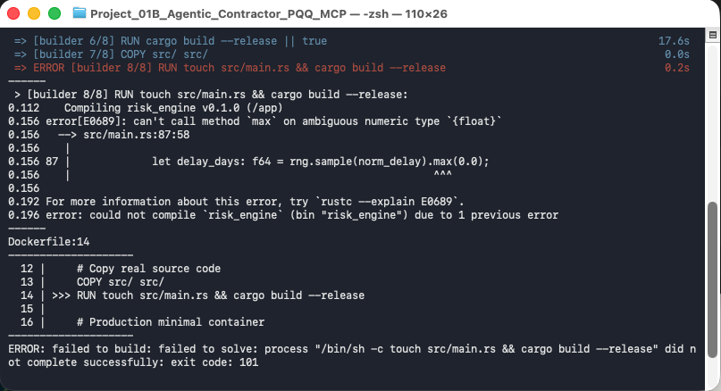
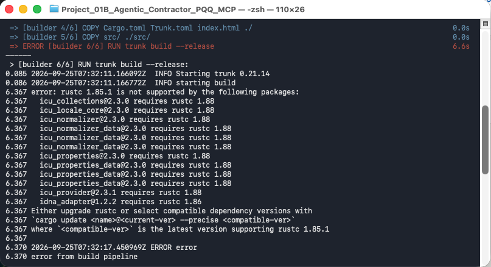
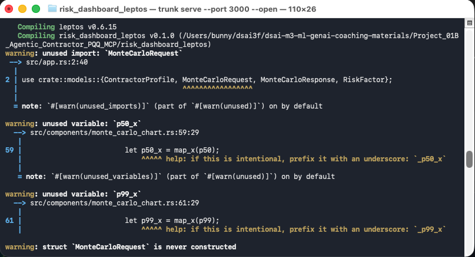

# <span style="color:red">🔧 10. Troubleshooting Guide</span> <span style="font-size: 14px; font-weight: normal;">[⬆️ Back to TOC](README.md#toc)</span>

This guide covers categorized issues, symptoms, root causes, and verified resolutions encountered when deploying and running the Enterprise Contractor Pre-Qualification & Compliance MCP Framework across local environments and cloud providers.

---

## <span id="troubleshooting-toc"></span>📑 Table Of Contents (TOC)

- [10.1 Database Initialization & Missing Table Schema](#issue-10-1)
- [10.2 FastMCP Stdio Subprocess Disconnection & Relative Path Resolution](#issue-10-2)
- [10.3 Safety Demerit Points & Debarment Status Overwriting](#issue-10-3)
- [10.4 AWS Amazon Nova Pro LLM Reasoning Payload Format Mismatch](#issue-10-4)
- [10.5 Non-Positive Equity in Financial Leverage Calculation](#issue-10-5)
- [10.6 MCP 2.x SDK Breaking Change and JSON-RPC Stdio Handshake Failure](#issue-10-6)
- [10.7 Rust 2024 Edition Incompatibility in Docker Multi-Stage Build](#issue-10-7)
- [10.8 Ambiguous Float Type Inference on Method Chaining in Rust 1.85+](#issue-10-8)
- [10.9 Port 8080 Collision: Docker Container vs Native Cargo Process](#issue-10-9)
- [10.10 Trunk Installation Failure on Outdated Rust Base Image in Leptos Dockerfile](#issue-10-10)
- [10.11 Transitive ICU Crate Dependency rustc 1.88 Requirement in Leptos Dockerfile](#issue-10-11)
- [10.12 Docker Container Name Conflict on Leptos Dashboard Execution](#issue-10-12)
- [10.13 Unused Import and Dead Code Compiler Warnings During Trunk Serve](#issue-10-13)
- [10.14 Azure Container App MissingSubscriptionRegistration for Microsoft.App](#issue-10-14)
- [10.15 FastMCP 2.x Pinning & Stdio Channel Pollution in Container Deployments](#issue-10-15)
- [10.16 Docker Multi-Platform Target Mismatch across Cloud Compute Platforms](#issue-10-16)
- [10.17 Google Artifact Registry 400 Bad Request on Missing Image Name & Provenance Attestations](#issue-10-17)
- [10.18 Terraform Output Attribute Mismatch for AWS Application Load Balancer](#issue-10-18)
- [10.19 Azure Container Apps Serverless Cold-Start and Envoy Connection Holding](#issue-10-19)
- [10.20 AWS Application Load Balancer HTTP 503 Service Temporarily Unavailable During Container Bootstrapping](#issue-10-20)

---

## <span id="issue-10-1"></span>🗄️ 10.1 Database Initialization & Missing Table Schema <span style="font-size: 14px; font-weight: normal;">[⬆️ Back to Troubleshooting TOC](#troubleshooting-toc)</span>

❌ **Error**: `sqlite3.OperationalError: no such table: contractors`

**Symptom**: When launching the FastAPI server or executing contractor screening queries via the web dashboard, the agent raises an unhandled SQLite operational exception, crashing the lookup process.

**Cause**: The FastAPI agent was launched before executing the database seeding script, leaving `contractors_registry.db` uncreated or empty on disk.

**Solution**: Execute `python mcp_server/mock_data.py` to seed the contractor registry database and create all required schema tables before starting the web server.

#### Before (Code causing the error in `terminal`):
```bash
# Ensure you are at the project root before starting
# Launching the agent without initializing the SQLite database
uvicorn agent_client.agent_api:app --host 0.0.0.0 --port 8000
```

#### After (Corrected code):
```bash
# Ensure you are at the project root before starting
# 1. Seed the contractor registry database first
python mcp_server/mock_data.py

# 2. Launch the agent client server
set -a; source .env; set +a
uvicorn agent_client.agent_api:app --host 0.0.0.0 --port 8000
```

---

## <span id="issue-10-2"></span>🔌 10.2 FastMCP Stdio Subprocess Disconnection & Relative Path Resolution <span style="font-size: 14px; font-weight: normal;">[⬆️ Back to Troubleshooting TOC](#troubleshooting-toc)</span>

❌ **Error**: `FileNotFoundError: [Errno 2] No such file or directory: 'mcp_server/server.py'`

**Symptom**: The FastAPI server boots up but fails during the startup lifespan handshake with `RuntimeError: Failed to connect to MCP server via stdio`. All subsequent `/chat` requests return 500 Internal Server Errors.

**Cause**: In `agent_api.py`, specifying the MCP server script using a relative string path (`mcp_server/server.py`) fails if the execution directory differs from the repository root (e.g. running uvicorn from within `agent_client/`).

**Solution**: Use `os.path.join(os.path.dirname(os.path.dirname(__file__)), 'mcp_server', 'server.py')` to resolve the absolute filesystem path relative to the executing file.

#### Before (Code causing the error in `agent_client/agent_api.py`):
```python
# Fragile relative path depends on current working directory
server_params = StdioServerParameters(
    command="python",
    args=["mcp_server/server.py"]
)
```

#### After (Corrected code in `agent_client/agent_api.py`):
```python
# Robust absolute path resolution independent of working directory
server_script = os.path.join(os.path.dirname(os.path.dirname(__file__)), 'mcp_server', 'server.py')
server_params = StdioServerParameters(
    command="python",
    args=[server_script]
)
```

---

## <span id="issue-10-3"></span>⚠️ 10.3 Safety Demerit Points & Debarment Status Overwriting <span style="font-size: 14px; font-weight: normal;">[⬆️ Back to Troubleshooting TOC](#troubleshooting-toc)</span>

❌ **Error**: `AssertionError: 'CRITICAL STATUTORY BAR' not found in safety compliance verdict`

**Symptom**: When auditing a high-risk contractor possessing both >= 25 MOM Safety Demerit Points and an active debarment order (such as Titan Piling), the verification tool outputs `STATUTORILY DEBARRED` but omits the mandatory 25-point foreign worker hiring freeze finding.

**Cause**: Sequential `if` statements in `server.py` caused the subsequent `if debarred:` condition to overwrite the `compliance_status` string previously assigned by the `if sdp >= 25:` evaluation.

**Solution**: Restructure conditional branching to explicitly evaluate the compound condition (`if sdp >= 25 and debarred:`) and report both statutory grounds in the compliance dossier.

#### Before (Code causing the error in `mcp_server/server.py`):
```python
# Faulty sequential assignment overwrites critical SDP bar
if sdp >= 25:
    compliance_status = "CRITICAL STATUTORY BAR (DISQUALIFIED)"
    reasons.append(f"Accumulated {sdp} Safety Demerit Points.")

if debarred:
    compliance_status = "STATUTORILY DEBARRED"
    reasons.append("Active Ministry of Manpower debarment status on record.")
```

#### After (Corrected code in `mcp_server/server.py`):
```python
# Combined branch checking both critical conditions simultaneously
if sdp >= 25 and debarred:
    compliance_status = "CRITICAL STATUTORY BAR & DEBARRED (DISQUALIFIED)"
    reasons.append(
        f"Accumulated {sdp} Safety Demerit Points (exceeds MOM legal threshold of 25 within 18 months). "
        f"Contractor is barred from hiring new foreign manpower and statutorily disqualified from public/tier-1 tenders."
    )
    reasons.append("Active Ministry of Manpower statutory debarment order on record.")
elif sdp >= 25:
    compliance_status = "CRITICAL STATUTORY BAR (DISQUALIFIED)"
    reasons.append(f"Accumulated {sdp} Safety Demerit Points (exceeds MOM legal threshold of 25 within 18 months).")
elif debarred:
    compliance_status = "STATUTORILY DEBARRED"
    reasons.append("Active Ministry of Manpower statutory debarment order on record.")
```

---

## <span id="issue-10-4"></span>🧠 10.4 AWS Amazon Nova Pro LLM Reasoning Payload Format Mismatch <span style="font-size: 14px; font-weight: normal;">[⬆️ Back to Troubleshooting TOC](#troubleshooting-toc)</span>

❌ **Error**: `AttributeError: 'list' object has no attribute 'replace' or 'strip'`

**Symptom**: When running the agent with `CLOUD_PROVIDER=AWS`, the FastAPI `/chat` endpoint crashes with an unhandled AttributeError, returning `"response": "Error: 'list' object has no attribute 'replace'"`.

**Cause**: Unlike OpenAI, Google Vertex AI, and local Ollama which return plain string message contents, Amazon Nova Pro via `langchain-aws` returns structured reasoning blocks as a list of dictionaries (e.g. `[{'type': 'text', 'text': '...'}]`).

**Solution**: Add type-checking in `agent_api.py` to extract the nested `'text'` property from list blocks before returning the response payload.

#### Before (Code causing the error in `agent_client/agent_api.py`):
```python
# Direct extraction assuming string output across all providers
ai_message = response['messages'][-1].content
return {"response": ai_message}
```

#### After (Corrected code in `agent_client/agent_api.py`):
```python
# Normalized response parsing across local and multi-cloud providers
ai_message = response['messages'][-1].content

if isinstance(ai_message, list):
    for block in ai_message:
        if isinstance(block, dict) and block.get('type') == 'text':
            ai_message = block.get('text', '')
            break
    else:
        ai_message = str(ai_message)

return {"response": ai_message}
```

---

## <span id="issue-10-5"></span>💰 10.5 Non-Positive Equity in Financial Leverage Calculation <span style="font-size: 14px; font-weight: normal;">[⬆️ Back to Troubleshooting TOC](#troubleshooting-toc)</span>

❌ **Error**: `ZeroDivisionError: float division by zero in financial solvency audit`

**Symptom**: When evaluating financially distressed contractors or special purpose entities with zero net worth or negative equity, `assess_financial_solvency` crashes with a division by zero error when computing the Debt-to-Equity ratio.

**Cause**: The calculation `debt / equity` executed directly without validating whether `equity > 0`.

**Solution**: Add defensive bounds checking assigning a maximum leverage risk score when equity is non-positive.

#### Before (Code causing the error in `mcp_server/server.py`):
```python
# Unprotected division by equity
debt_equity = debt / equity
```

#### After (Corrected code in `mcp_server/server.py`):
```python
# Guarded division handling non-positive equity gracefully
debt_equity = debt / equity if equity > 0 else 999.0
```

---

## <span id="issue-10-6"></span>📦 10.6 MCP 2.x SDK Breaking Change and JSON-RPC Stdio Handshake Failure <span style="font-size: 14px; font-weight: normal;">[⬆️ Back to Troubleshooting TOC](#troubleshooting-toc)</span>

❌ **Error**: `pydantic_core._pydantic_core.ValidationError: 1 validation error for union[JSONRPCRequest,JSONRPCNotification,JSONRPCResponse,JSONRPCError] Invalid JSON: expected value at line 1 column 1 [type=json_invalid, input_value="FastMCP server 'Enterprise Contractor Compliance MCP' dummy run called.", input_type=str]`

**Symptom**: During FastAPI server startup (`uvicorn agent_client.agent_api:app`), the application crashes during the lifespan context initialization. The client fails to establish a JSON-RPC session over stdio, reporting that the child process returned plain text instead of valid JSON-RPC 2.0 payloads.

**Cause**: Newly created Python environments pull the latest `mcp` package (v2.x). In MCP 2.x, the class `FastMCP` was renamed and relocated to `MCPServer` (`mcp.server.mcpserver`). Because `mcp_server/server.py` imported `from mcp.server.fastmcp import FastMCP` inside a fallback `try/except ImportError` block, the import failed and activated the mock dummy class, which outputs non-JSON diagnostic strings directly to stdout.

**Solution**: Pin the MCP package dependency to `mcp<2` in `environment.yml` to preserve stable v1 FastMCP compatibility across all client and server stdio adapters.

#### Before (Code causing the error in `environment.yml`):
```yaml
dependencies:
  - python=3.11
  - pip
  - pip:
      - mcp
      - pydantic
```

#### After (Corrected code in `environment.yml`):
```yaml
dependencies:
  - python=3.11
  - pip
  - pip:
      - "mcp<2"
      - pydantic
```

---

## <span id="issue-10-7"></span>🦀 10.7 Rust 2024 Edition Incompatibility in Docker Multi-Stage Build <span style="font-size: 14px; font-weight: normal;">[⬆️ Back to Troubleshooting TOC](#troubleshooting-toc)</span>

❌ **Error**: `error: failed to download hyper-util v0.1.21 Caused by: feature edition2024 is required. The package requires the Cargo feature called edition2024, but that feature is not stabilized in this version of Cargo (1.80.1)`

**Symptom**: Executing `docker build -t risk-engine risk_engine/` fails at step `[builder 8/8] RUN touch src/main.rs && cargo build --release`. Cargo halts during crate resolution when parsing transitive networking dependencies such as `hyper-util`.

**Cause**: Modern crate releases pulled by Cargo now leverage features from the Rust 2024 edition. The base container image in `risk_engine/Dockerfile` utilized `rust:1.80-alpine`, which predates stabilization of Rust 2024 edition features in the compiler toolchain.

**Solution**: Upgrade the builder stage base image in `risk_engine/Dockerfile` from `rust:1.80-alpine` to `rust:1.85-alpine` to provide native support for Cargo 2024 edition manifests.

#### Before (Code causing the error in `risk_engine/Dockerfile`):
```dockerfile
# Multi-stage Docker build for high-performance Rust Axum risk sidecar
FROM rust:1.80-alpine AS builder

WORKDIR /app
RUN apk add --no-cache musl-dev
```

#### After (Corrected code in `risk_engine/Dockerfile`):
```dockerfile
# Multi-stage Docker build for high-performance Rust Axum risk sidecar
FROM rust:1.85-alpine AS builder

WORKDIR /app
RUN apk add --no-cache musl-dev
```

---

## <span id="issue-10-8"></span>🔢 10.8 Ambiguous Float Type Inference on Method Chaining in Rust 1.85+ <span style="font-size: 14px; font-weight: normal;">[⬆️ Back to Troubleshooting TOC](#troubleshooting-toc)</span>

❌ **Error**: `error[E0689]: can't call method max on ambiguous numeric type {float} --> src/main.rs:87:58 let delay_days: f64 = rng.sample(norm_delay).max(0.0);`



**Symptom**: Compiling the high-performance Axum risk engine sidecar with `cargo build --release` or during the Docker builder step fails with compiler error `E0689`. The compiler refuses to chain `.max(0.0)` directly on the sample expression.

**Cause**: In modern Rust compiler editions (1.85+), calling chained floating-point methods on generic distribution sample results (`rng.sample(norm_delay).max(...)`) triggers ambiguous type inference because the distribution's output type is inferred lazily across the method chain rather than bound immediately to `f64`.

**Solution**: Separate the random distribution sampling and the mathematical clamping into explicit steps with concrete `f64` type annotation.

#### Before (Code causing the error in `risk_engine/src/main.rs`):
```rust
// Chained method call on ambiguous float type from distribution sample
let norm_delay = Normal::new(18.0, 8.0).unwrap();
let delay_days: f64 = rng.sample(norm_delay).max(0.0);
```

#### After (Corrected code in `risk_engine/src/main.rs`):
```rust
// Disambiguated concrete f64 type assignment before calling max method
let norm_delay = Normal::new(18.0, 8.0).unwrap();
let sample_delay: f64 = rng.sample(norm_delay);
let delay_days: f64 = sample_delay.max(0.0);
```

---

## <span id="issue-10-9"></span>🚫 10.9 Port 8080 Collision: Docker Container vs Native Cargo Process <span style="font-size: 14px; font-weight: normal;">[⬆️ Back to Troubleshooting TOC](#troubleshooting-toc)</span>

❌ **Error**: `thread 'main' panicked at src/main.rs:57:62: called Result::unwrap() on an Err value: Os { code: 48, kind: AddrInUse, message: "Address already in use" }`

**Symptom**: Running the risk engine natively via `cargo run --release` crashes immediately on startup with operating system error code 48 (`EADDRINUSE`).

**Cause**: The Docker container `risk-engine-sidecar` was previously started in the background using `docker run -d -p 8080:8080 ...` (Option A). Because the Docker daemon is already bound to host port `8080`, the native Cargo process attempting to bind to `0.0.0.0:8080` is rejected by macOS network sockets.

**Solution**: Stop and remove the existing Docker container before running the service natively with Cargo, or conversely, terminate any native Cargo process before launching the container.

#### Before (Code causing the error in `terminal`):
```bash
# Ensure you are at the project root before starting
# Attempting to start native cargo while Docker container is still bound to port 8080
cd risk_engine
cargo run --release
```

#### After (Corrected code in `terminal`):
```bash
# Ensure you are at the project root before starting
# 1. Stop and remove the background Docker container occupying port 8080
docker stop risk-engine-sidecar && docker rm risk-engine-sidecar

# 2. Launch the Axum microservice natively with Cargo
cd risk_engine
cargo run --release
```

---

## <span id="issue-10-10"></span>🌐 10.10 Trunk Installation Failure on Outdated Rust Base Image in Leptos Dockerfile <span style="font-size: 14px; font-weight: normal;">[⬆️ Back to Troubleshooting TOC](#troubleshooting-toc)</span>

❌ **Error**: `error: cannot install package trunk 0.21.14, it requires rustc 1.81.0 or newer, while the currently active rustc version is 1.78.0`

**Symptom**: Executing `docker build -t risk-dashboard-leptos risk_dashboard_leptos/` fails at step `[builder 2/6] RUN rustup target add wasm32-unknown-unknown && cargo install --locked trunk`. Cargo aborts the installation of Trunk.

**Cause**: The Leptos builder stage in `risk_dashboard_leptos/Dockerfile` specified `rust:1.78-bookworm`. The latest Trunk release (`v0.21.14`) mandates a minimum Rust compiler version of `rustc >= 1.81.0`.

**Solution**: Upgrade the builder base image in `risk_dashboard_leptos/Dockerfile` from `rust:1.78-bookworm` to `rust:1.85-bookworm`.

#### Before (Code causing the error in `risk_dashboard_leptos/Dockerfile`):
```dockerfile
# Stage 1: Build the Leptos WASM application with Trunk
FROM rust:1.78-bookworm AS builder

# Install WebAssembly target and Trunk build tool
RUN rustup target add wasm32-unknown-unknown && \
    cargo install --locked trunk
```

#### After (Corrected code in `risk_dashboard_leptos/Dockerfile`):
```dockerfile
# Stage 1: Build the Leptos WASM application with Trunk
FROM rust:1.85-bookworm AS builder

# Install WebAssembly target and Trunk build tool
RUN rustup target add wasm32-unknown-unknown && \
    cargo install --locked trunk
```

---

## <span id="issue-10-11"></span>🌐 10.11 Transitive ICU Crate Dependency rustc 1.88 Requirement in Leptos Dockerfile <span style="font-size: 14px; font-weight: normal;">[⬆️ Back to Troubleshooting TOC](#troubleshooting-toc)</span>

❌ **Error**: `error: rustc 1.85.1 is not supported by the following packages: icu_collections@2.3.0 requires rustc 1.88, idna_adapter@1.2.2 requires rustc 1.86`



**Symptom**: During `docker build -t risk-dashboard-leptos risk_dashboard_leptos/`, the build fails at step `[builder 6/6] RUN trunk build --release`. Cargo terminates the build pipeline with exit status 101, reporting that transitive dependencies (`icu_*` v2.3.0 and `idna_adapter` v1.2.2) mandate a newer compiler version than `rustc 1.85.1`.

**Cause**: Although `rust:1.85-bookworm` satisfies the Trunk CLI compilation requirement, unpinned transitive dependencies resolved by Cargo during the WASM build process require newer compiler capabilities introduced in Rust 1.86 and Rust 1.88.

**Solution**: Update the builder stage base image in `risk_dashboard_leptos/Dockerfile` to `rust:bookworm` (which provides the latest stable Rust toolchain, `rustc 1.98.1`), providing full forward compatibility for all transitive crates.

#### Before (Code causing the error in `risk_dashboard_leptos/Dockerfile`):
```dockerfile
# Stage 1: Build the Leptos WASM application with Trunk
FROM rust:1.85-bookworm AS builder

# Install WebAssembly target and Trunk build tool
RUN rustup target add wasm32-unknown-unknown && \
    cargo install --locked trunk
```

#### After (Corrected code in `risk_dashboard_leptos/Dockerfile`):
```dockerfile
# Stage 1: Build the Leptos WASM application with Trunk
FROM rust:bookworm AS builder

# Install WebAssembly target and Trunk build tool
RUN rustup target add wasm32-unknown-unknown && \
    cargo install --locked trunk
```

---

## <span id="issue-10-12"></span>🐳 10.12 Docker Container Name Conflict on Leptos Dashboard Execution <span style="font-size: 14px; font-weight: normal;">[⬆️ Back to Troubleshooting TOC](#troubleshooting-toc)</span>

❌ **Error**: `docker: Error response from daemon: Conflict. The container name "/leptos-dashboard-app" is already in use by container "e5737f794c3aac180d329862804c5f29fbc5fca5fb69dd76b4f7abd0bb32ade1". You have to remove (or rename) that container to be able to reuse that name.`

**Symptom**: Executing `docker run -d -p 3000:80 --name leptos-dashboard-app risk-dashboard-leptos` fails with a daemon conflict error. Running `docker stop risk-dashboard-leptos` subsequently yields `Error response from daemon: No such container: risk-dashboard-leptos`.

**Cause**: Docker enforces strictly unique container names across both running and stopped containers. A previously stopped container instance named `leptos-dashboard-app` still existed on the system (visible via `docker ps -a`, but hidden from standard `docker ps`). Attempting cleanup with `risk-dashboard-leptos` failed because that is the image repository tag name, not the container instance name specified via `--name`.

**Solution**: Force-remove the existing container instance by its explicit container name (`docker rm -f leptos-dashboard-app`) before executing `docker run`.

#### Before (Code causing the error in `terminal`):
```bash
# Ensure you are at the project root before starting
# Attempting cleanup using the image tag instead of the container name
docker stop risk-dashboard-leptos && docker rm risk-dashboard-leptos

# Re-running fails with container name collision
docker run -d -p 3000:80 --name leptos-dashboard-app risk-dashboard-leptos
```

#### After (Corrected code in `terminal`):
```bash
# Ensure you are at the project root before starting
# 1. Force-remove the existing container instance by its assigned container name
docker rm -f leptos-dashboard-app

# 2. Launch the Leptos WASM dashboard container cleanly
docker run -d -p 3000:80 --name leptos-dashboard-app risk-dashboard-leptos
```

---

## <span id="issue-10-13"></span>🦀 10.13 Unused Import and Dead Code Compiler Warnings During Trunk Serve <span style="font-size: 14px; font-weight: normal;">[⬆️ Back to Troubleshooting TOC](#troubleshooting-toc)</span>

❌ **Error**: `warning: unused import: MonteCarloRequest`, `warning: unused variable: p50_x`, `warning: unused variable: p99_x`



**Symptom**: When running `trunk serve --port 3000 --open`, the terminal outputs yellow `warning:` messages regarding unused imports in `src/app.rs` and unused coordinate variables in `src/components/monte_carlo_chart.rs`.

**Cause**: In the Rust compiler (`rustc`), warnings indicate unused variables, redundant imports, or dead code. Unlike compiler errors (which abort execution with non-zero exit codes), warnings are non-fatal notifications. Trunk continues building the WebAssembly bundle and successfully launches the HTTP server. However, unaddressed warnings clutter developer build logs.

**Solution**: Clean up unused imports and dead variables across the Leptos dashboard codebase:
1. In `src/app.rs`: Remove `MonteCarloRequest` from the `use crate::models::{...}` import declaration.
2. In `src/components/monte_carlo_chart.rs`: Remove unused `p50_x`, `p99_x`, `p50`, and `p99` calculations.
3. In `src/models.rs`: Add `#[allow(dead_code)]` to the `MonteCarloRequest` struct so it remains available for external API serialization without triggering unused warnings.

#### Before (Code causing the warnings in `risk_dashboard_leptos/src/app.rs`):
```rust
use leptos::*;
use crate::models::{ContractorProfile, MonteCarloRequest, MonteCarloResponse, RiskFactor};
use crate::components::{AdversarialChallenge, AuditCard, MonteCarloChart, RiskSlider};
```

#### After (Corrected code in `risk_dashboard_leptos/src/app.rs`):
```rust
use leptos::*;
use crate::models::{ContractorProfile, MonteCarloResponse, RiskFactor};
use crate::components::{AdversarialChallenge, AuditCard, MonteCarloChart, RiskSlider};
```

---

## <span id="issue-10-14"></span>☁️ 10.14 Azure Container App MissingSubscriptionRegistration for Microsoft.App <span style="font-size: 14px; font-weight: normal;">[⬆️ Back to Troubleshooting TOC](#troubleshooting-toc)</span>

❌ **Error**: `Error: creating Container App Environment: (Code: "MissingSubscriptionRegistration") The subscription is not registered to use namespace 'Microsoft.App'. See https://aka.ms/rps-not-found for how to register subscriptions.`

**Symptom**: When running `terraform apply` in `terraform/azure`, the infrastructure creation fails at step `azurerm_container_app_environment.mcp_env: Creating...` with status code 409 Conflict.

**Cause**: Newly created Azure subscriptions or subscriptions deploying Azure Container Apps for the first time do not have the `Microsoft.App` resource provider registered in the subscription namespace.

**Solution**: Execute the Azure CLI provider registration command with the `--wait` flag before initializing and applying the Terraform plan.

#### Before (Code causing the error in `terminal`):
```bash
# Ensure you are at the project root before starting
# Applying Terraform on Azure without registering Microsoft.App namespace
cd terraform/azure
terraform apply -auto-approve
```

#### After (Corrected code in `terminal`):
```bash
# Ensure you are at the project root before starting
# 1. Register the Microsoft.App resource provider and wait for confirmation
az provider register --namespace Microsoft.App --wait

# 2. Proceed with Terraform provisioning
cd terraform/azure
terraform apply -auto-approve
```

---

## <span id="issue-10-15"></span>📦 10.15 FastMCP 2.x Pinning & Stdio Channel Pollution in Container Deployments <span style="font-size: 14px; font-weight: normal;">[⬆️ Back to Troubleshooting TOC](#troubleshooting-toc)</span>

❌ **Error**: `pydantic_core._pydantic_core.ValidationError: 1 validation error for union[JSONRPCRequest,JSONRPCNotification,JSONRPCResponse,JSONRPCError] Invalid JSON: expected value at line 1 column 1 [type=json_invalid, input_value="FastMCP server 'Enterprise Contractor Compliance MCP' dummy run called.", input_type=str]`

**Symptom**: When the containerized application starts up on AWS ECS Fargate or Cloud Run, the Application Load Balancer returns `503 Service Temporarily Unavailable` because the FastAPI server crashes during startup. CloudWatch container logs reveal that the child stdio MCP process printed plain text dummy logs instead of valid JSON-RPC 2.0 payloads.

**Cause**: In `mcp_server/requirements.txt` and `agent_client/requirements.txt`, the `mcp` dependency was unpinned (`mcp`). Building a new Docker image resolved the latest `mcp` v2.x package, where `FastMCP` was refactored into `MCPServer`. The `try / except ImportError` block in `mcp_server/server.py` caught the import error and defaulted to a mock fallback class that emitted diagnostic strings to `sys.stdout`. Because JSON-RPC stdio IPC uses stdout as its wire protocol, the non-JSON string broke client JSON-RPC deserialization.

**Solution**: Pin `mcp<2` in both `mcp_server/requirements.txt` and `agent_client/requirements.txt`, and redirect fallback diagnostic messages in `mcp_server/server.py` to `sys.stderr` so that stdout remains clean.

#### Before (Code causing the error in `mcp_server/requirements.txt`):
```text
fastapi>=0.110.0
uvicorn>=0.28.0
mcp
pydantic>=2.0.0
```

#### After (Corrected code in `mcp_server/requirements.txt`):
```text
fastapi>=0.110.0
uvicorn>=0.28.0
mcp<2
pydantic>=2.0.0
```

---

## <span id="issue-10-16"></span>🏗️ 10.16 Docker Multi-Platform Target Mismatch across Cloud Compute Platforms <span style="font-size: 14px; font-weight: normal;">[⬆️ Back to Troubleshooting TOC](#troubleshooting-toc)</span>

❌ **Error**: `exec /bin/sh: exec format error` or ECS task failing initial target group health checks on AWS Fargate.

**Symptom**: The container image builds successfully on an Apple Silicon Mac, but when deployed to cloud compute (e.g., AWS Fargate), the task continually stops and restarts, causing the ALB target group to register 503 errors.

**Cause**: Running `docker build -t ...` without an explicit `--platform` flag on Apple Silicon Macs produces an image matching host architecture (`linux/arm64`). If the target infrastructure configuration specifies `X86_64` (or vice-versa), the Linux kernel aborts process execution with an architecture mismatch error.

**Solution**: Pass the explicit platform target flag during Docker builds: `--platform linux/arm64` for AWS Graviton / ARM64 tasks (as configured in `terraform/aws/main.tf`), and `--platform linux/amd64` for Azure Container Apps and Google Cloud Run.

#### Before (Code causing the error in `terminal`):
```bash
# Ensure you are at the project root before starting
# Implicit host architecture build defaults to Mac host architecture
docker build -t enterprise-mcp-agent .
```

#### After (Corrected code in `terminal`):
```bash
# Ensure you are at the project root before starting
# For AWS Graviton/ARM64 ECS Task Definition:
docker build --platform linux/arm64 -t enterprise-mcp-agent .

# For Azure Container Apps & Google Cloud Run (AMD64):
docker build --platform linux/amd64 --provenance=false -t enterprise-mcp-agent .
```

---

## <span id="issue-10-17"></span>🌐 10.17 Google Artifact Registry 400 Bad Request on Missing Image Name & Provenance Attestations <span style="font-size: 14px; font-weight: normal;">[⬆️ Back to Troubleshooting TOC](#troubleshooting-toc)</span>

❌ **Error**: `unknown: unexpected status from HEAD request to https://us-central1-docker.pkg.dev/v2/development-460317/enterprise-mcp-agent/manifests/latest: 400 Bad Request` and `{"errors":[{"code":"NAME_INVALID","message":"Missing image name. Pulls should be of the form docker pull HOST-NAME/PROJECT-ID/REPOSITORY/IMAGE"}]}`

**Symptom**: Executing `docker push ${AR_URL}:latest` halts with `400 Bad Request`. When visiting `${CLOUD_RUN_URL}/docs`, the browser displays Google's starter page (`<title>Congratulations | Cloud Run</title>`) instead of the FastAPI Swagger documentation.

**Cause**: Two distinct issues occurred:
1. **Hierarchical Naming**: Unlike AWS ECR or Docker Hub where the repository name is the image name, Google Artifact Registry organizes packages hierarchically: `REGION-docker.pkg.dev/PROJECT_ID/REPOSITORY/IMAGE:TAG`. Tagging directly to `${AR_URL}:latest` omits the required `IMAGE` name component, which Artifact Registry rejects with `NAME_INVALID`.
2. **Buildx Attestations**: Modern Docker Desktop Buildx attaches default in-toto provenance and SBOM metadata layers that standard Artifact Registry endpoints reject.

**Solution**: Build using `--provenance=false`, tag with the full four-part hierarchy `${AR_URL}/enterprise-mcp-agent:latest`, push to Artifact Registry, and trigger a Cloud Run revision deployment using `gcloud run deploy`.

#### Before (Code causing the error in `terminal`):
```bash
# Ensure you are at the project root before starting
# Tagging only up to the repository level omits the image name
AR_URL=$(terraform output -raw artifact_registry_url)
docker tag enterprise-mcp-agent:latest ${AR_URL}:latest
docker push ${AR_URL}:latest
```

#### After (Corrected code in `terminal`):
```bash
# Ensure you are at the project root before starting
# 1. Build without Buildx attestations
docker build --platform linux/amd64 --provenance=false -t enterprise-mcp-agent .

# 2. Tag with the full 4-tier Artifact Registry path
AR_URL=$(terraform output -raw artifact_registry_url)
docker tag enterprise-mcp-agent:latest ${AR_URL}/enterprise-mcp-agent:latest
docker push ${AR_URL}/enterprise-mcp-agent:latest

# 3. Deploy the container image to Google Cloud Run
gcloud run deploy enterprise-mcp-agent \
  --image ${AR_URL}/enterprise-mcp-agent:latest \
  --region us-central1 \
  --quiet
```

---

## <span id="issue-10-18"></span>📜 10.18 Terraform Output Attribute Mismatch for AWS Application Load Balancer <span style="font-size: 14px; font-weight: normal;">[⬆️ Back to Troubleshooting TOC](#troubleshooting-toc)</span>

❌ **Error**: `Warning: No outputs found` or empty `${ALB_DNS}` variable when executing verification curl commands.

**Symptom**: Copying documentation commands to capture `ALB_DNS=$(terraform output -raw alb_dns)` assigns an empty string, causing `curl ${ALB_DNS}/docs` to fail with `curl: (3) URL using bad/illegal format or missing URL`.

**Cause**: In `terraform/aws/outputs.tf`, the output block was declared as `output "alb_url"`, but Section 5.3 in `README.md` referenced `alb_dns`.

**Solution**: Align the documentation code block with the declared Terraform output identifier `alb_url`.

#### Before (Code causing the error in `README.md`):
```bash
# Mismatched Terraform output identifier
cd terraform/aws
ALB_DNS=$(terraform output -raw alb_dns)
curl ${ALB_DNS}/docs
```

#### After (Corrected code in `README.md`):
```bash
# Corrected matching Terraform output identifier
cd terraform/aws
ALB_DNS=$(terraform output -raw alb_url)
curl ${ALB_DNS}/docs
```

---

## <span id="issue-10-19"></span>⏳ 10.19 Azure Container Apps Serverless Cold-Start and Envoy Connection Holding <span style="font-size: 14px; font-weight: normal;">[⬆️ Back to Troubleshooting TOC](#troubleshooting-toc)</span>

❌ **Error**: `curl: (28) Operation timed out` or client connection hanging indefinitely on the first request to `${CONTAINER_APP_URL}/docs`.

**Symptom**: When issuing the first `curl` request to the Azure Container App URL immediately after updating the image, the terminal command hangs with no output.

**Cause**: Azure Container Apps is configured with `min_replicas = 0` (serverless scale-to-zero). When the first HTTP request arrives at the built-in Envoy edge proxy:
1. Azure dynamically scales the replica from 0 to 1.
2. The FastAPI application boots and executes its lifespan startup handler:
   - Initializing the Entra ID Managed Identity token exchange (`DefaultAzureCredential` via IMDS endpoint `169.254.169.254`).
   - Starting the child FastMCP stdio subprocess.
   - Initializing the Azure OpenAI GPT-4o client session.
3. During this cold-start initialization window (~20-30 seconds), Envoy holds the HTTP connection open while waiting for the upstream container on port 8000. If the client timeout is too short, curl aborts before the container finishes warming up.

**Solution**: Allow 20-30 seconds for the initial cold-start request to complete, or use `curl -m 45` / retry the request once the replica reaches its `Active` / `Healthy` state. All subsequent requests respond instantaneously.

#### Before (Command causing confusion in `terminal`):
```bash
# Short timeout or immediate curl during initial replica cold-start
curl https://${CONTAINER_APP_URL}/docs
```

#### After (Corrected approach in `terminal`):
```bash
# Ensure you are at the project root before starting
# Allow up to 45 seconds for serverless scale-from-zero and Entra ID authentication
curl -m 45 https://${CONTAINER_APP_URL}/docs
```

---

## <span id="issue-10-20"></span>🌐 10.20 AWS Application Load Balancer HTTP 503 Service Temporarily Unavailable During Container Bootstrapping <span style="font-size: 14px; font-weight: normal;">[⬆️ Back to Troubleshooting TOC](#troubleshooting-toc)</span>

❌ **Error**: `HTTP 503 Service Temporarily Unavailable` when accessing `${ALB_URL}` or `${ALB_URL}/docs` immediately after Docker image push. (Note: This 503 error will NOT appear on Azure or Google Cloud Run).

**Symptom**: Executing `open ${ALB_URL}` or `curl ${ALB_URL}/docs` directly following `docker push` results in an HTTP 503 error in the browser or terminal. This error will **never appear on Azure or Google Cloud Run**; it is strictly an AWS Application Load Balancer health check characteristic.

**Cause**: The three major Cloud Service Providers handle ingress routing and container readiness with fundamentally distinct architectural mechanisms:

1. **AWS Application Load Balancer (ALB) - Fail-Fast on Zero Healthy Targets**:
   - The AWS ALB relies on decoupled, asynchronous health check probes against the Target Group (`/` on port 8000).
   - After `docker push ${ECR_URL}:latest`, AWS ECS Fargate requires 45 to 60 seconds to pull the image layers from ECR, boot the container, and pass 2 consecutive health check probes.
   - During this initialization window, the Target Group has **0 healthy targets**. Because ALB fails fast to avoid queueing stalled connections, it immediately rejects incoming requests with `HTTP 503 Service Temporarily Unavailable`.

2. **Azure Container Apps (ACA) - Envoy Ingress Connection Holding**:
   - Azure Container Apps fronts dynamic container replicas with an integrated Envoy reverse proxy.
   - When a browser connects to `${CONTAINER_APP_URL}`, Envoy accepts the TCP/TLS connection immediately, preventing an HTTP 503 error.
   - During serverless scale-from-zero (~20-30 seconds), Envoy holds the HTTP connection open while the container boots and completes the Entra ID IMDS token exchange (`169.254.169.254`). The browser displays a white, spinning loading screen until the container returns HTTP 200 OK.

3. **Google Cloud Run (GCP) - Synchronous Health Gating**:
   - Google Cloud Run utilizes a synchronous deployment mechanism (`gcloud run deploy ... --quiet`).
   - The CLI command does not exit back to your shell until Google has provisioned the revision, verified container health, and completed the 100% traffic shift.
   - Consequently, by the time the terminal executes `open ${CLOUD_RUN_URL}`, Cloud Run is already actively serving traffic, resulting in instantaneous, zero-delay rendering.

| Cloud Provider | Ingress Architecture | Immediate `open` Behavior | Recovery Time |
| :--- | :--- | :--- | :--- |
| **AWS** | AWS ALB + ECS Fargate | **HTTP 503 (Fail-Fast)** | ~60 seconds (Target Group probes pass) |
| **Azure** | Envoy Edge Proxy + ACA | **Blank / Spinning Screen (Connection Held)** | ~20-30 seconds (Scale-from-zero boots) |
| **GCP** | Google Front-End + Cloud Run | **Instant Display (Zero Error)** | 0 seconds (`gcloud run deploy` is synchronous) |

**Solution**: Wait approximately 60 seconds (1 minute) after completing the Docker image push to Amazon ECR before opening the AWS Web Dashboard URL. Once the target registers as healthy, the ALB immediately serves the Web Dashboard.

#### Before (Command executed prematurely in `terminal`):
```bash
# Ensure you are at the project root before starting
# Opening URL immediately after push while target group has 0 healthy targets
docker push ${ECR_URL}:latest
open ${ALB_URL}
# Results in: HTTP 503 Service Temporarily Unavailable
```

#### After (Corrected workflow with container health check wait in `terminal`):
```bash
# Ensure you are at the project root before starting
# Allow ~60 seconds for ECS Fargate container boot and ALB health check verification
docker push ${ECR_URL}:latest

# Wait 60s for ALB target group health check to turn healthy
sleep 60

# Access the live Web Dashboard
open ${ALB_URL}
```


