# <span style="color:red">🛠️ S02: Implementation Guide & Technical Runbook</span>

[📄 Go to S02 Business Problem Statement & Case Studies](BUSINESS_PROBLEM_STATEMENT.md) | [⬆️ Back to ACIP Overview](../README.md#toc)

---

**S02: Agentic Bid Evaluation & Tender Intelligence** is an assistive decision-support module designed for Quantity Surveyors, Commercial Directors, and Tender Evaluation Committees in the Architecture, Engineering, and Construction (AEC) sector.

### 🛡️ Technical Scope & Architectural Boundaries
- **🧪 Working Reference Implementation**: S02 is an active, functional implementation with synthetic hospital tender data, an in-process DuckDB columnar database, deterministic FastMCP calculation engines, multi-agent adversarial deliberation, and an automated verification test suite.
- **⚖️ Decision-Support Boundary**: S02 produces auditable rate leveling, Z-score outlier alerts, cash-flow front-loading indices, and draft clarification letters. S02 cannot autonomously award contracts or disqualify bidders. Official commercial award recommendations strictly require licensed human Quantity Surveyor and statutory tender board authorization.

---

## <span id="toc"></span>📑 Table Of Contents (TOC)

- [0. Pre-requisite Software](#prerequisites)
- [1. Architecture Overview](#architecture-overview)
  - [1.1 System Architecture & Dual-Envelope Control Plane](#system-architecture)
  - [1.2 End-to-End Pipeline Workflow: Ingestion, Deterministic Gates & Multi-Agent Deliberation](#pipeline-workflow)
  - [1.3 Human-in-the-Loop Governance & Tender Board Authority](#governance)
- [2. Directory Structure](#directory-structure)
- [3. Approach 1: Pure Local Sovereign Deployment & Testing (Zero Cost)](#local-deployment)
  - [3.1 Environment Configuration & Dependencies](#env-config)
  - [3.2 Woodlands Health Campus Benchmark Dataset (S$120M Baseline & 5 Bidder Traps)](#dataset-benchmarks)
  - [3.3 FastMCP Deterministic Calculation Engine (Z-Score, FLRI, Scope Exclusions, PQM)](#fastmcp-engine)
  - [3.4 Multi-Agent Cognitive Deliberation Client (Forensic QS, Legal, Chairman)](#multi-agent-client)
  - [3.5 Medallion Architecture Analytical Pipeline (Bronze -> Silver -> Gold ETL)](#medallion-pipeline)
  - [3.6 Executive Analytical Dashboard (Local Web Visual Intelligence on Port 8085)](#analytical-dashboard)
- [4. Approach 2: Hybrid Testing Sandbox (Local Application + Cloud LLM APIs)](#hybrid-testing)
  - [4.1 Cloud LLM Provider Credentials & Environment (.env)](#hybrid-env)
  - [4.2 Cloud-Backed Executive Analytical Dashboard (AWS, Azure, GCP)](#hybrid-dashboard)
- [5. Approach 3: Cloud Workload Direct Provisioning (Multi-Cloud Terraform Deployments)](#cloud-provisioning)
  - [5.1 Why Choose Cloud Workload Direct Provisioning?](#why-cloud-native)
  - [5.2 Pre-requisites for Approach 3](#cloud-native-prerequisites)
  - [5.3 AWS Deployment (ECS Fargate + Amazon Bedrock)](#terraform-aws)
  - [5.4 Azure Deployment (Azure Container Apps + Azure OpenAI)](#terraform-azure)
  - [5.5 Google Cloud Deployment (Google Cloud Run + Vertex AI)](#terraform-gcp)
- [6. Approach 4: Enterprise Multi-Account Landing Zone & Sovereign Governance (Planned)](#enterprise-landing-zone)
  - [6.1 Dedicated Sovereign Tender Enclaves & Network Isolation](#tender-enclaves)
  - [6.2 Audit Trails, RBAC & Statutory Tender Board Compliance](#audit-rbac)
- [7. Automated Testing & Verification](#automated-testing)
- [8. Clean Up](#cleanup)
- [9. Frequently Asked Questions (FAQ)](FAQ.md)
- [10. Troubleshooting Guide](TROUBLESHOOTING.md)

---

## <span id="prerequisites"></span><span style="color:red">⚙️ 0. Pre-requisite Software</span> <span style="font-size: 14px; font-weight: normal;">[⬆️ Back to TOC](#toc)</span>

📝 Note: Shell & Minimum Requirements: All terminal commands in this technical runbook are written for Unix/macOS Bash or Zsh shells (execute using Git Bash or WSL2 on Windows). For Approach 1 (Pure Local Sovereign), only Conda, Python, and DuckDB are required. Terraform and Cloud CLIs are only needed if you choose to explore cloud provider integrations (Approach 2 & 3) or enterprise multi-account landing zone IaC provisioning.

Before beginning, ensure the following software is installed on the host machine:

- **Python 3.11+**: Core runtime environment for multi-agent orchestration and analytical pipelines. Download from the [Python Official Website](https://www.python.org/downloads/).
- **DuckDB 1.1+**: High-performance in-process columnar SQL OLAP database engine for instant zero-copy analytical queries across multi-bidder BOQ pricing schedules. Download from the [DuckDB Official Website](https://duckdb.org/).
- **Conda / Miniconda**: Package and virtual environment management system. Download from the [Miniconda Official Website](https://docs.conda.io/en/latest/miniconda.html) or [Anaconda Official Website](https://www.anaconda.com/download).
- **Docker 24.0+**: Container runtime for building, tagging, and publishing multi-platform container images to enterprise cloud container registries (AWS ECR, Azure ACR, and Google Artifact Registry) in Approach 3. Download from the [Docker Official Website](https://docs.docker.com/get-docker/).
- **Terraform 1.5+**: Infrastructure-as-code automation tool for multi-cloud workload provisioning across AWS, Azure, and Google Cloud Platform. Download from the [HashiCorp Official Website](https://developer.hashicorp.com/terraform/downloads).
- **Cloud CLIs**: Install the CLI for the specific cloud platform you plan to deploy or test:
  - **AWS CLI**: For AWS ECS Fargate & Amazon Bedrock deployments. Download from the [AWS CLI Official Website](https://docs.aws.amazon.com/cli/latest/userguide/getting-started-install.html).
  - **Azure CLI**: For Azure Container Apps & Azure OpenAI deployments. Download from the [Azure CLI Official Website](https://learn.microsoft.com/en-us/cli/azure/install-azure-cli).
  - **Google Cloud SDK**: For Google Cloud Run & Vertex AI deployments. Download from the [Google Cloud SDK Official Website](https://cloud.google.com/sdk/docs/install).

Software verification commands:

```bash
python3 --version
python3 -c "import duckdb; print('DuckDB Version:', duckdb.__version__)"
conda --version
docker --version
terraform --version
aws --version
az --version
gcloud --version
```

Expected terminal output:

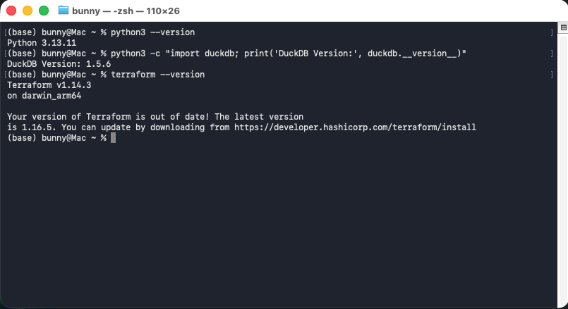

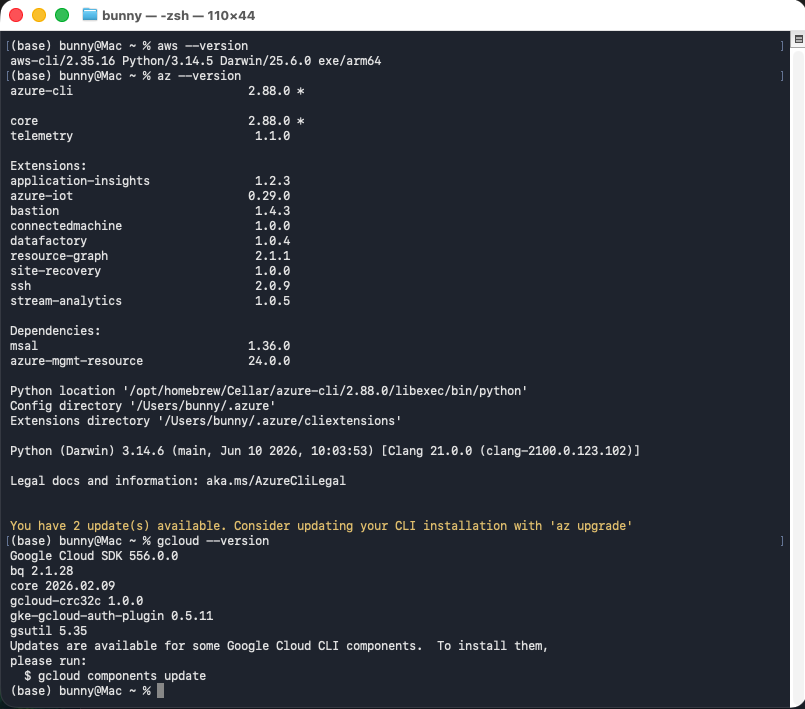

---

## <span id="architecture-overview"></span><span style="color:red">🏗️ 1. Architecture Overview</span> <span style="font-size: 14px; font-weight: normal;">[⬆️ Back to TOC](#toc)</span>

### <span id="system-architecture"></span>🏛️ 1.1 System Architecture & Dual-Envelope Control Plane <span style="font-size: 14px; font-weight: normal;">[⬆️ Back to TOC](#toc)</span>

In major institutional and commercial developments across Singapore, public and private tender boards evaluate multi-volume commercial bids and technical proposals under demanding statutory deadlines. 

Manual bid leveling across disparate contractor spreadsheets frequently overlooks three critical commercial risks:
1. **Cash-Flow Front-Loading**: Inflating early substructure rates while deflating late-stage MEP to extract unearned capital in months 1 to 9.
2. **Concealed Scope Exclusions**: Hiding critical trade exclusions inside qualification schedule letters to submit artificially low headline sums.
3. **Abnormally Low Tender (ALT) Default Traps**: Submitting unsustainably low dumping rates that lead to subcontractor abandonment upon commodity price spikes.

**S02: Agentic Bid Evaluation & Tender Intelligence** solves this through a dual-envelope architecture that combines high-performance DuckDB columnar processing, deterministic FastMCP mathematical calculation gates, and multi-agent adversarial debate.

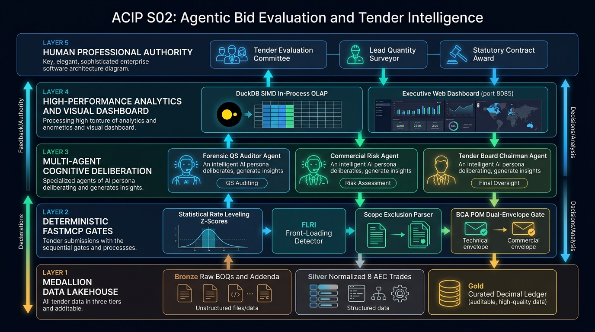

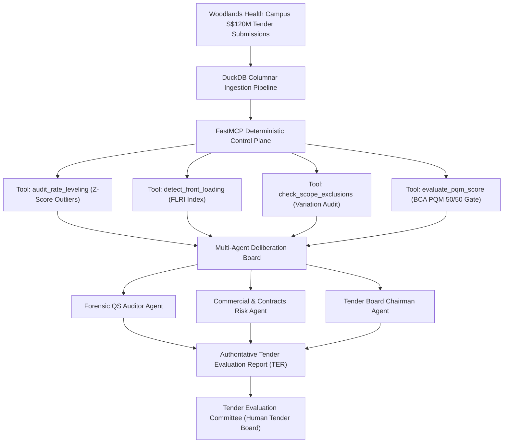
```mermaid
graph TD
    A["Woodlands Health Campus S$120M Tender Submissions"] --> B["DuckDB Columnar Ingestion Pipeline"]
    B --> C["FastMCP Deterministic Control Plane"]
    C --> D1["Tool: audit_rate_leveling (Z-Score Outliers)"]
    C --> D2["Tool: detect_front_loading (FLRI Index)"]
    C --> D3["Tool: check_scope_exclusions (Variation Audit)"]
    C --> D4["Tool: evaluate_pqm_score (BCA PQM 50/50 Gate)"]
    D1 --> E["Multi-Agent Deliberation Board"]
    D2 --> E
    D3 --> E
    D4 --> E
    E --> F1["Forensic QS Auditor Agent"]
    E --> F2["Commercial & Contracts Risk Agent"]
    E --> F3["Tender Board Chairman Agent"]
    F1 --> G["Authoritative Tender Evaluation Report (TER)"]
    F2 --> G
    F3 --> G
    G --> H["Tender Evaluation Committee (Human Tender Board)"]
```

### <span id="pipeline-workflow"></span>🔄 1.2 End-to-End Pipeline Workflow: Ingestion, Deterministic Gates & Multi-Agent Deliberation <span style="font-size: 14px; font-weight: normal;">[⬆️ Back to TOC](#toc)</span>

The evaluation lifecycle follows five sequential, non-conflated stages:
1. **Ingestion & Normalization**: Raw bidder submissions (JSON/CSV) are ingested into DuckDB, normalizing line items to the Employer's Pre-Tender Estimate (PTE) trade structure.
2. **Deterministic Rate Leveling**: Statistical algorithms compute unit rate variances, market medians, and line-item Z-scores across all competing contractors.
3. **Temporal Cash-Flow & Exclusion Audit**: The engine measures substructure capital extraction ratios against the project baseline and cross-examines addenda qualification clauses.
4. **BCA Price-Quality Scoring**: Deterministic formulas calculate commercial price scores and technical quality ratings based on official BCA guidelines.
5. **Multi-Agent Deliberation & Reporting**: Forensic QS, Commercial Risk, and Board Chairman agents synthesize findings, draft targeted clarification letters, and generate the final Tender Evaluation Report (TER).

### <span id="governance"></span>⚖️ 1.3 Human-in-the-Loop Governance & Tender Board Authority <span style="font-size: 14px; font-weight: normal;">[⬆️ Back to TOC](#toc)</span>

All score rankings, Z-score flags, and draft clarification letters generated by S02 serve strictly as assistive analytical evidence. 

Under Singapore public procurement guidelines and institutional developer governance:
1. S02 cannot disqualify any tenderer autonomously.
2. S02 cannot award contracts or issue binding commitments.
3. The official Tender Evaluation Report must be deliberated, signed, and authorized by certified human Quantity Surveyors and appointed Tender Board Committee members.

📝 Note: For statutory and technical background on contractor pre-qualification and licensing grades, refer to the [S01 Reference Implementation](../S01_Agentic_Contractor_PQQ_And_Compliance_Intelligence/README.md).

---

## <span id="directory-structure"></span><span style="color:red">📂 2. Directory Structure</span> <span style="font-size: 14px; font-weight: normal;">[⬆️ Back to TOC](#toc)</span>

The physical directory tree of S02 exactly mirrors the layout on disk:

```text
S02_Agentic_Bid_Evaluation_And_Tender_Intelligence/
├── agent_client/
│   └── evaluator.py
├── dashboard/
│   ├── index.html
│   └── server.py
├── data/
│   ├── tender_submissions/
│   │   ├── B01_197600888B_submission.json
│   │   ├── B02_198900123C_submission.json
│   │   ├── B03_201500888F_submission.json
│   │   ├── B04_197000345C_submission.json
│   │   └── B05_201000333E_submission.json
│   ├── generate_tender_data.py
│   ├── hospital_tender.duckdb
│   └── medallion_pipeline.py
├── images/
│   ├── approach_1_local_sovereign.png
│   ├── approach_2_hybrid_sandbox.png
│   ├── approach_3_cloud_workload.png
│   ├── approach_4_enterprise_landing_zone.png
│   ├── architecture_aws.png
│   ├── architecture_azure.png
│   ├── architecture_gcp.png
│   ├── s02_architecture_diagram.png
│   ├── s02_dashboard_approach_2_aws_8085_light_mode.png
│   ├── s02_dashboard_approach_2_azure_8085_light_mode.png
│   ├── s02_dashboard_approach_2_gcp_8085_light_mode.png
│   ├── s02_dashboard_approach_2_local_8085_light_mode.png
│   ├── s02_dashboard_approach_3_aws_8085_light_mode.png
│   ├── s02_dashboard_approach_3_azure_8085_light_mode.png
│   ├── s02_dashboard_approach_3_gcp_8085_light_mode.png
│   ├── s02_dashboard_forensic_drawer_dark_mode.png
│   ├── s02_dashboard_forensic_drawer_light_mode.png
│   ├── s02_dashboard_local_8085_dark_mode.png
│   └── s02_dashboard_local_8085_light_mode.png
├── mcp_server/
│   └── server.py
├── terraform/
│   ├── aws/
│   │   ├── main.tf
│   │   ├── outputs.tf
│   │   ├── terraform.tfvars.example
│   │   └── variables.tf
│   ├── azure/
│   │   ├── main.tf
│   │   ├── outputs.tf
│   │   ├── terraform.tfvars.example
│   │   └── variables.tf
│   └── gcp/
│       ├── main.tf
│       ├── outputs.tf
│       ├── terraform.tfvars.example
│       └── variables.tf
├── tests/
│   └── test_s02_pipeline.py
├── .env.example
├── BUSINESS_PROBLEM_STATEMENT.md
├── Dockerfile
├── FAQ.md
├── README.md
├── requirements.txt
└── TROUBLESHOOTING.md
```

---

## <span id="local-deployment"></span><span style="color:red">💻 3. Approach 1: Pure Local Sovereign Deployment & Testing (Zero Cost)</span> <span style="font-size: 14px; font-weight: normal;">[⬆️ Back to TOC](#toc)</span>

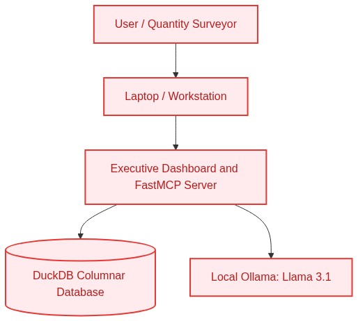

Approach 1 runs 100% locally on standard workstation hardware with zero external API calls or cloud subscription costs.

### <span id="env-config"></span>⚙️ 3.1 Environment Configuration & Dependencies <span style="font-size: 14px; font-weight: normal;">[⬆️ Back to TOC](#toc)</span>

Because ACIP contains many modules (S01 to S07) sharing one Conda environment, every bash block in this README starts with `cd "${ACIP_MODULE_DEFAULT_FOLDER}"`. This guarantees commands run inside the S02 module folder no matter which terminal tab or folder you are currently in.

Step 1: Set the module folder once (open a terminal inside the S02 folder in your IDE, or if starting from the ACIP platform root, navigate into the S02 folder first):

```bash
# If starting from the ACIP platform root:
cd S02_Agentic_Bid_Evaluation_And_Tender_Intelligence

# Ensure you are at the S02_Agentic_Bid_Evaluation_And_Tender_Intelligence module root folder before starting
export ACIP_MODULE_DEFAULT_FOLDER="$(pwd)"
echo "${ACIP_MODULE_DEFAULT_FOLDER}"
```

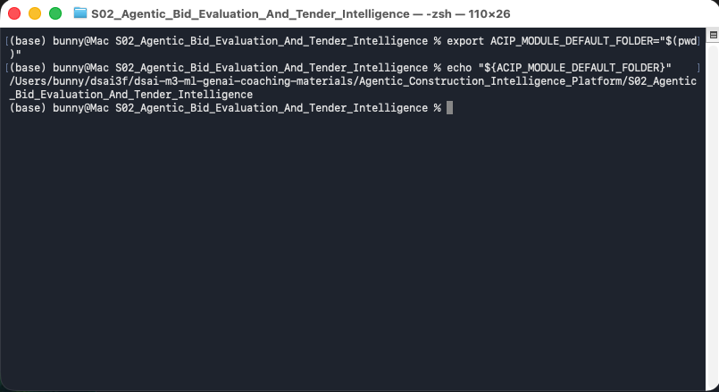

Step 2: Create (first time only) and activate the unified ACIP Conda environment:

We require conda environment `acip_mcp_framework` to be created before you can run the codes documented in this module. If you have not done so, please run the following command to create the environment:

```bash
# Ensure you are at the S02_Agentic_Bid_Evaluation_And_Tender_Intelligence module root folder before starting
cd "${ACIP_MODULE_DEFAULT_FOLDER}"
conda env create -f ../environment.yml
```

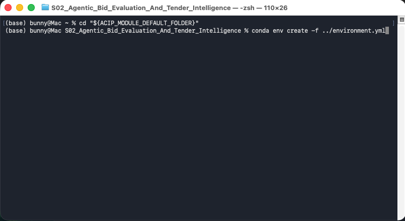

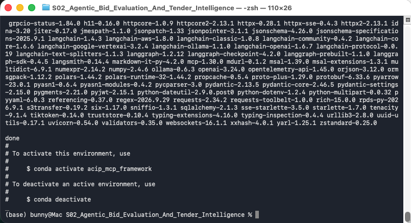

This is followed by activating the environment:

```bash
# Ensure you are at the S02_Agentic_Bid_Evaluation_And_Tender_Intelligence module root folder before starting
conda activate acip_mcp_framework
```

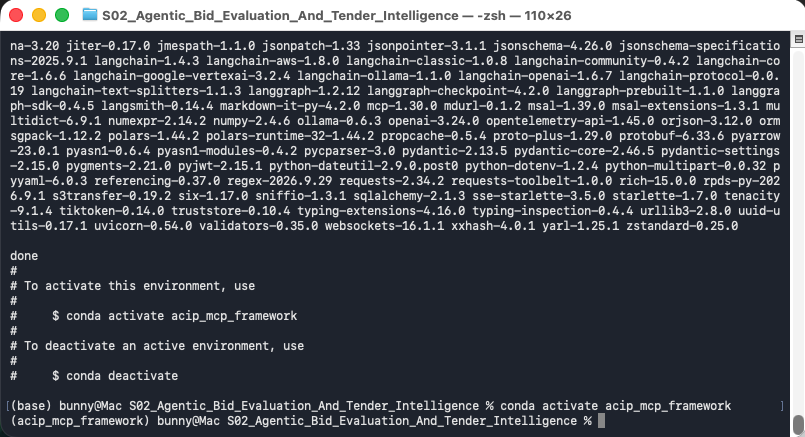

📝 Note: If you have already created `acip_mcp_framework` (e.g. while working in S01 or another ACIP module), skip `conda env create` and proceed directly to `conda activate acip_mcp_framework`.

Step 3: Create a local `.env` configuration file from `.env.example`:

```bash
# Ensure you are at the S02_Agentic_Bid_Evaluation_And_Tender_Intelligence module root folder before starting
cd "${ACIP_MODULE_DEFAULT_FOLDER}"
cp .env.example .env
set -a; source .env; set +a
```

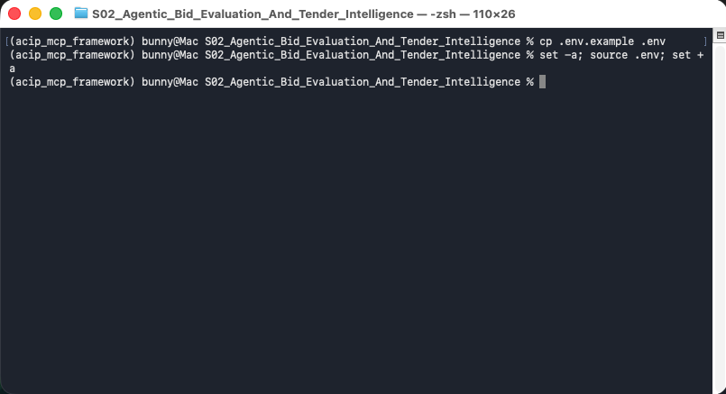

📝 Note: `ACIP_MODULE_DEFAULT_FOLDER` is managed as an environment variable in your shell or Conda environment and is not stored inside `.env`.


### <span id="dataset-benchmarks"></span>🏥 3.2 Woodlands Health Campus Benchmark Dataset (S$120M Baseline & 5 Bidder Traps) <span style="font-size: 14px; font-weight: normal;">[⬆️ Back to TOC](#toc)</span>

The reference dataset models the **Woodlands Health Campus Acute Care Wing**, establishing an employer Pre-Tender Estimate (PTE) baseline of **S$114,999,998.90 Base + S$5.0M Contingency = S$120.0M Total**.

#### Primary Trade Packages (8 Core AEC Divisions)

| Trade ID | Trade Package Name | Project Work Stage | Construction Category | PTE Allocation (SGD) | Allocation Share |
| :---: | :--- | :--- | :--- | :---: | :---: |
| **TRD-01** | Demolition & Site Clearance | Early Works | Substructure | S$3,500,000.00 | 3.04% |
| **TRD-02** | Deep Basement Excavation & ERSS | Early Works | Substructure | S$8,500,000.00 | 7.39% |
| **TRD-03** | Bored Piling & Diaphragm Walls | Early Works | Substructure | S$14,000,000.00 | 12.17% |
| **TRD-04** | Reinforced Concrete Superstructure | Mid Works | Superstructure | S$26,000,000.00 | 22.61% |
| **TRD-05** | Architectural Finishes & Facade | Late Works | Finishes | S$18,000,000.00 | 15.65% |
| **TRD-06** | Mechanical, Electrical & HVAC Services | Late Works | Services | S$28,000,000.00 | 24.35% |
| **TRD-07** | Medical Gas & Cleanroom Piping | Late Works | Services | S$12,000,000.00 | 10.43% |
| **TRD-08** | External Works, Drainage & Landscaping | Late Works | External | S$5,000,000.00 | 4.35% |
| **TOTAL** | **Consolidated Employer Baseline (PTE)** | - | - | **S$114,999,998.90** | **100.00%** |

#### Five Competing Main Contractor Bidders & Injected Traps

The database contains a Master Registry of **50 BCA registered contractors** across Singapore (Grades A1, A2, B1, B2). For the Woodlands Health Campus Acute Care Wing (`tender_id = 'TND-WHC-2026-001'`), 5 shortlisted main contractors submitted bids, reusing canonical contractor profiles established in Module S01 to maintain cross-module consistency:

| Bidder ID | Main Contractor Name | BCA Grade | Submitted Sum (SGD) | Variance vs PTE | Injected Commercial Strategy & Hidden Trap |
| :---: | :--- | :--- | :--- | :---: | :--- |
| **B01** | Heng Win (Private) Limited | CW01-A1 | S$113,870,045.25 | -0.98% | **Compliant Benchmark**: Clean, balanced rates within 1.0% of client baseline. |
| **B02** | WinningPine Construction Pte Ltd | CW01-A1 | S$121,550,200.50 | +5.70% | **Cash-Flow Front-Loader**: Substructure inflated to S$48.1M (+85%), late MEP deflated (-35%). |
| **B03** | Starlight Urban Infrastructure Pte Ltd | CW01-A2 | S$76,059,987.75 | -33.86% | **Abnormally Low Tender (ALT)**: Aggressive -34% dumping. Safety demerit points: 12. |
| **B04** | GemStone Building Contractors Pte Ltd | CW01-A1 | S$105,149,742.25 | -8.57% | **Concealed Scope Exclusion**: Excludes S$6.79M medical gas piping on page 38 (QUAL-14.2). |
| **B05** | Titan Piling & Civil Engineering Pte Ltd | CW01-A1 | S$128,800,003.10 | +12.00% | **Outlier Over-Price**: Defensive bid priced 12% above employer budget. |

📝 Note: For detailed commercial background, contractual risk mechanics, and real-world Singapore case studies (such as substructure cash extraction and concealed ERSS scope exclusions), see the [S02 Business Problem Statement & Case Studies](BUSINESS_PROBLEM_STATEMENT.md#case-studies).

Generate the dataset into DuckDB:

```bash
# Ensure you are at the S02_Agentic_Bid_Evaluation_And_Tender_Intelligence module root folder before starting
cd "${ACIP_MODULE_DEFAULT_FOLDER}"
python3 data/generate_tender_data.py
```

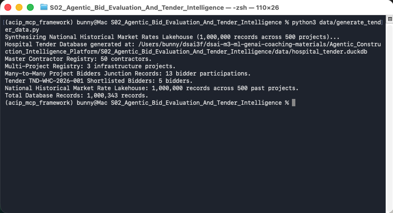

### <span id="fastmcp-engine"></span>⚡ 3.3 FastMCP Deterministic Calculation Engine (Z-Score, FLRI, Scope Exclusions, PQM) <span style="font-size: 14px; font-weight: normal;">[⬆️ Back to TOC](#toc)</span>

All mathematical calculations and scoring gates execute strictly within deterministic Python code. LLMs are never permitted to define scoring formulas.

#### 1. Statistical Rate Leveling & Z-Score Formula

For each BOQ line item i across all N competing bidders:

```text
Mean_Rate(i) = (1 / N) * SUM(Rate(i, j)) for j = 1 to N
Variance(i) = (1 / (N - 1)) * SUM((Rate(i, j) - Mean_Rate(i))^2)
StdDev(i) = SQRT(Variance(i))
Z_Score(i, j) = (Rate(i, j) - Mean_Rate(i)) / StdDev(i)
```

A line item is deterministically flagged as a commercial anomaly whenever `abs(Z_Score) >= 1.5` or `abs(Variance_vs_PTE_Pct) >= 35.0%`.

#### 2. Front-Loading Risk Index (FLRI) Formulation

```text
Substructure_Pct(Bidder) = (Substructure_Sum(Bidder) / Total_Bid_Sum(Bidder)) * 100
Benchmark_Substructure_Pct = (PTE_Substructure_Sum / PTE_Total_Sum) * 100
Front_Loading_Risk_Index (FLRI) = Substructure_Pct(Bidder) / Benchmark_Substructure_Pct
Early_Cash_Extraction_SGD = Substructure_Sum(Bidder) - (PTE_Substructure_Sum * (Total_Bid_Sum(Bidder) / PTE_Total_Sum))
```

Whenever `FLRI >= 1.30` or `Substructure_Pct >= 32.0%`, the system generates an immediate `HIGH_FRONT_LOADING_RISK` alert.

#### 3. BCA Price-Quality Method (PQM) Scoring Model

Operates on a configurable dual-envelope ratio (Default: 50% Price / 50% Quality):

```text
PQM_Composite_Score = (Price_Score * Price_Weight) + (Quality_Score * Quality_Weight)
```

1. **Commercial Price Score (100 Points Max)**:
   - Evaluated against median tender sum (P_med).
   - Bids within 0.90 to 1.05 of median: `100 - (abs(1.0 - (Bid / P_med)) * 150)`.
   - Bids below 0.75 of median: Trigger mandatory statutory Abnormally Low Tender (ALT) penalty, scaling down to 10 points.
2. **Technical Quality Score (100 Points Max)**:
   - **BCA CONQUAS Score (40 Points Max)**: `(CONQUAS / 100) * 40`.
   - **Track Record & Grade (30 Points Max)**: CW01-A1 grade = 15 pts, experience years up to 25 yrs = 15 pts.
   - **Safety Performance (30 Points Max)**: 30 pts base minus `Safety_Demerit_Points * 2.5`.

📝 Note: Developer / White-Box Mathematical Inspection: This step executes a standalone dry-run of the FastMCP deterministic calculation engine. It prints the raw JSON evaluation payload to the terminal so technical auditors and software engineers can independently verify that statistical Z-scores, FLRI cash-flow curves, and statutory PQM pricing algorithms execute without LLM calculation errors. Quantity Surveyors, Commercial Directors, and business users who prefer the interactive visual interface can safely skip this step and proceed directly to Section 3.5 (Medallion Lakehouse) or Section 3.6 (Executive Dashboard).

Run the FastMCP calculation server:

```bash
# Ensure you are at the S02_Agentic_Bid_Evaluation_And_Tender_Intelligence module root folder before starting
cd "${ACIP_MODULE_DEFAULT_FOLDER}"
set -a; source .env; set +a
python3 mcp_server/server.py
```

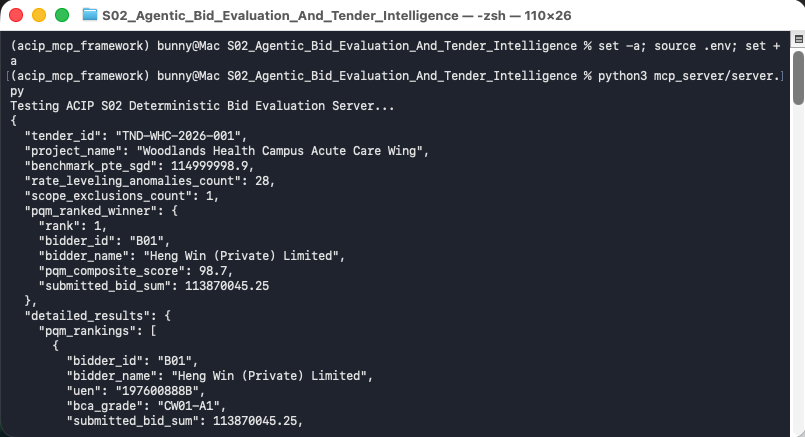

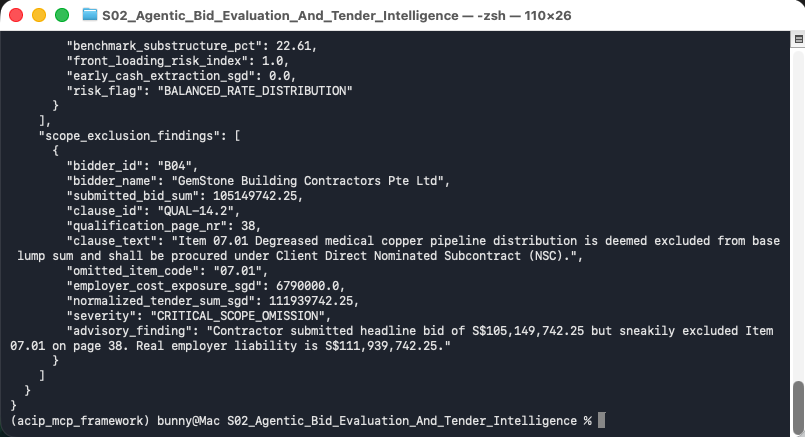

### <span id="multi-agent-client"></span>🤖 3.4 Multi-Agent Cognitive Deliberation Client (Forensic QS, Legal, Chairman) <span style="font-size: 14px; font-weight: normal;">[⬆️ Back to TOC](#toc)</span>

Once deterministic FastMCP tools compute statistical anomalies, the multi-agent cognitive layer analyzes the evidence across three specialized personas:

1. **Forensic QS Auditor Agent**: Audits rate-leveling and front-loading outputs, uncovering B02's S$20.6M cash extraction attempt and B03's dumping.
2. **Commercial & Contracts Risk Agent**: Cross-examines contractor qualification letters, uncovering B04's clause QUAL-14.2 on page 38 (S$6.79M variation liability).
3. **Tender Board Chairman Agent**: Synthesizes findings with the deterministic PQM leaderboard and drafts targeted clarification letters.

The below commands are optional. If you are interested to see the JSON output generated by the FastMCP tools, run the below multi-agent deliberation client:

```bash
# Ensure you are at the S02_Agentic_Bid_Evaluation_And_Tender_Intelligence module root folder before starting
cd "${ACIP_MODULE_DEFAULT_FOLDER}"
set -a; source .env; set +a
python3 agent_client/evaluator.py
```

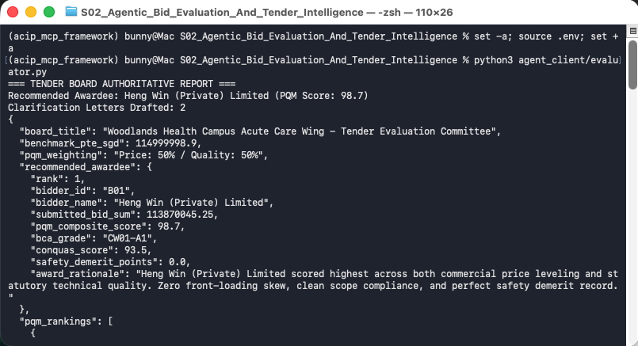

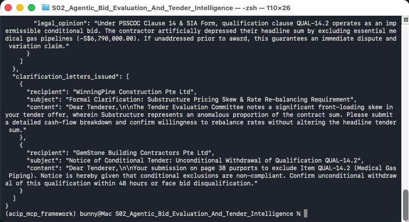

### <span id="medallion-pipeline"></span>🏅 3.5 Medallion Architecture Analytical Pipeline (Bronze -> Silver -> Gold ETL) <span style="font-size: 14px; font-weight: normal;">[⬆️ Back to TOC](#toc)</span>

S02 implements an in-process Medallion Lakehouse pattern directly within DuckDB, converting raw, unstructured contractor data into audit-grade commercial intelligence:

1. **Bronze Layer (`bronze_raw_bids`, `bronze_raw_qualifications`)**: Raw, immutable ingestion vault storing raw submitted line items, addenda qualification text, and timestamped audit logs.
2. **Silver Layer (`silver_normalized_trades`)**: Cleaned and validated dataset with standardized quantities mapped to the 8 core AEC trade packages, unit rate variance calculations, and contractor UEN normalization.
3. **Gold Layer (`gold_tender_leaderboard`)**: Curated analytical models computed with `DECIMAL(18,2)` precision, encapsulating Front-Loading Risk Indices (FLRI), unearned cash-flow extraction curves, Z-score distributions, and statutory BCA PQM dual-envelope composite scores.

The below commands are optional. But if you want to visually check the 3-layer Medallion Lakehouse pattern, execute the Medallion ETL pipeline:

```bash
# Ensure you are at the S02_Agentic_Bid_Evaluation_And_Tender_Intelligence module root folder before starting
cd "${ACIP_MODULE_DEFAULT_FOLDER}"
python3 data/medallion_pipeline.py
```

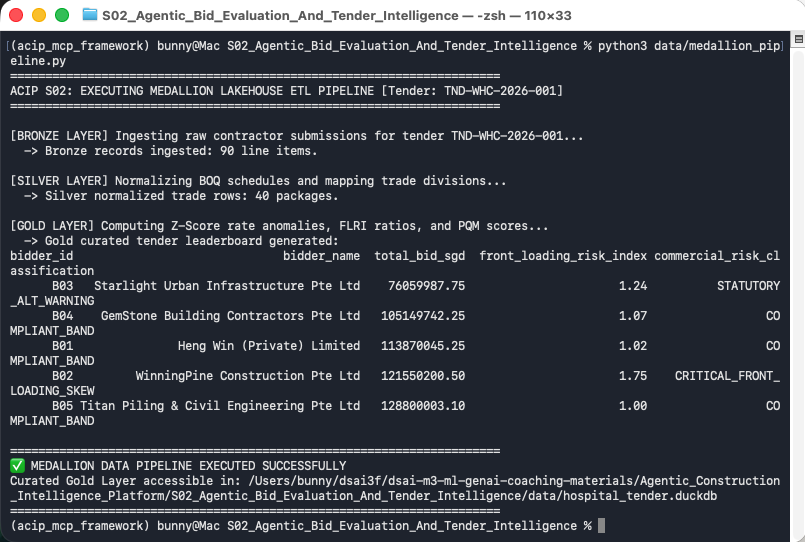

### <span id="analytical-dashboard"></span>📊 3.6 Executive Analytical Dashboard (Local Web Visual Intelligence on Port 8085) <span style="font-size: 14px; font-weight: normal;">[⬆️ Back to TOC](#toc)</span>

S02 provides a dedicated web-based visual intelligence dashboard engineered for Tender Evaluation Committees and Commercial Directors. The dashboard renders real-time telemetry extracted directly from the DuckDB Gold Layer over an embedded JSON API.

Launch the local analytical dashboard server:

```bash
# Ensure you are at the S02_Agentic_Bid_Evaluation_And_Tender_Intelligence module root folder before starting
cd "${ACIP_MODULE_DEFAULT_FOLDER}"
python3 dashboard/server.py
```

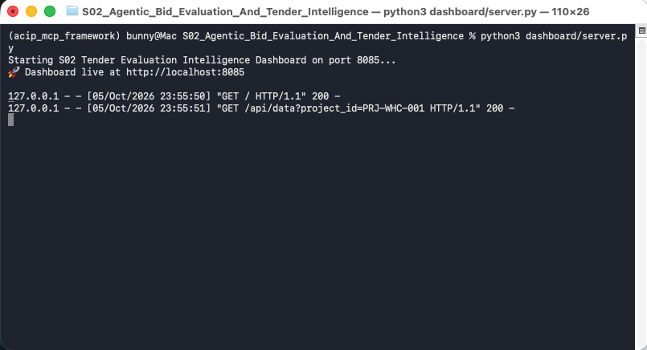

Open `http://localhost:8085` in any standard web browser to view the interactive executive command center:

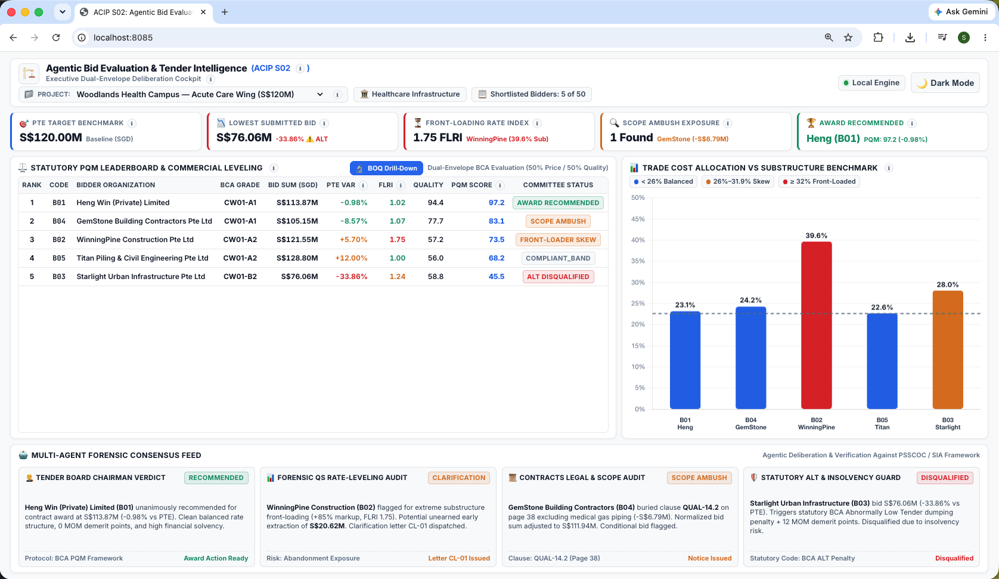

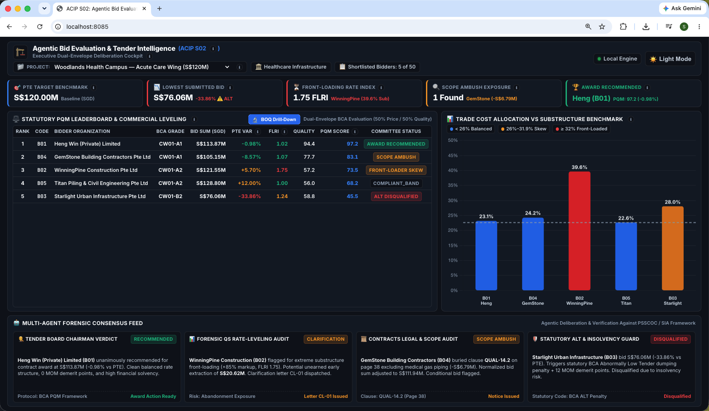

#### Forensic BOQ Rate-Leveling Drill-Down Drawer (Zero-Black-Box Evidence)
Clicking on any contractor row in the PQM leaderboard table or selecting the **🔬 BOQ Drill-Down** button slides open the forensic analysis drawer, presenting line-item rate variances against the Pre-Tender Estimate (PTE), Front-Loading Risk Index (FLRI) calculations, and clause qualification audits:

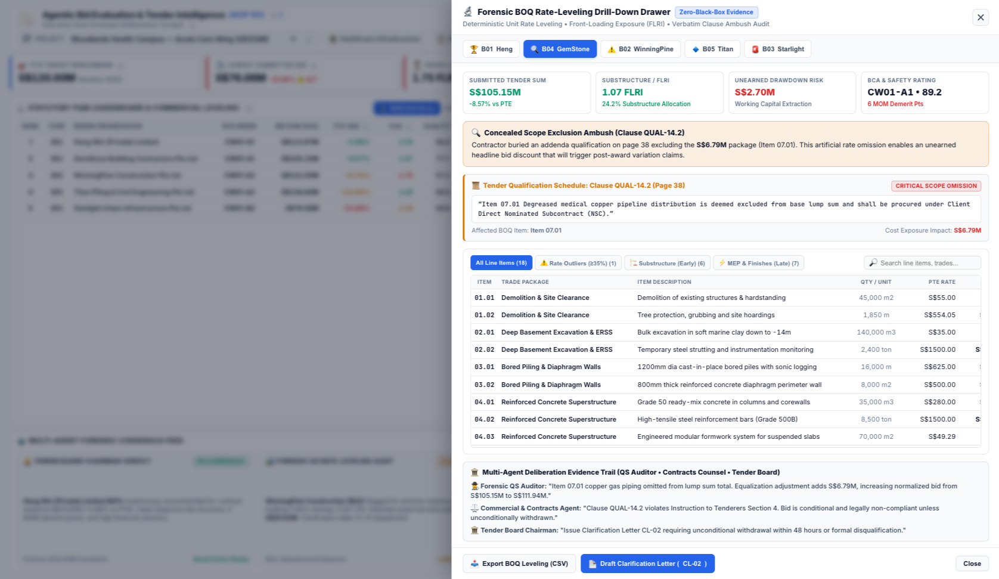

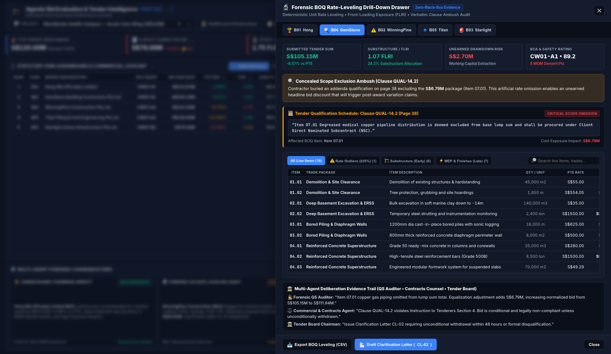

#### Visual Intelligence Features
- **Statutory PQM Leaderboard**: Live dual-envelope ranking matrix displaying Price Scores, Quality Scores (CONQUAS, BCA Grading, Track Record, Safety Demerit Deductions), and final PQM totals. Clickable rows trigger forensic contractor audit.
- **Forensic BOQ Rate-Leveling Drill-Down Drawer**: Anti-black-box evidence panel displaying line-by-line unit rate variance, substructure allocation percentages, FLRI indices, unearned drawdown exposure, and verbatim clause qualifications (e.g., Clause QUAL-14.2 medical copper piping omission of S$6.79M).
- **Front-Loading Risk Meter**: Visual gauge comparing contractor substructure allocations against the 22.61% PTE benchmark, highlighting WinningPine Construction's (B02) 1.75x skew and S$20.62M unearned capital extraction exposure.
- **Cognitive Multi-Agent Live Feed**: Displays the verified reference consensus trail produced by the multi-agent deliberation pipeline (Forensic QS Auditor, Commercial Risk Agent, Tender Board Chairman) with direct citations to qualification clause QUAL-14.2 and screening ALT warnings.
- **Interactive Light / Dark Mode Toggle**: Responsive interface providing seamless toggle between default Light Mode and Dark Mode for prolonged auditing comfort.

---

## <span id="hybrid-testing"></span><span style="color:red">☁️ 4. Approach 2: Hybrid Testing Sandbox (Local Application + Cloud LLM APIs)</span> <span style="font-size: 14px; font-weight: normal;">[⬆️ Back to TOC](#toc)</span>

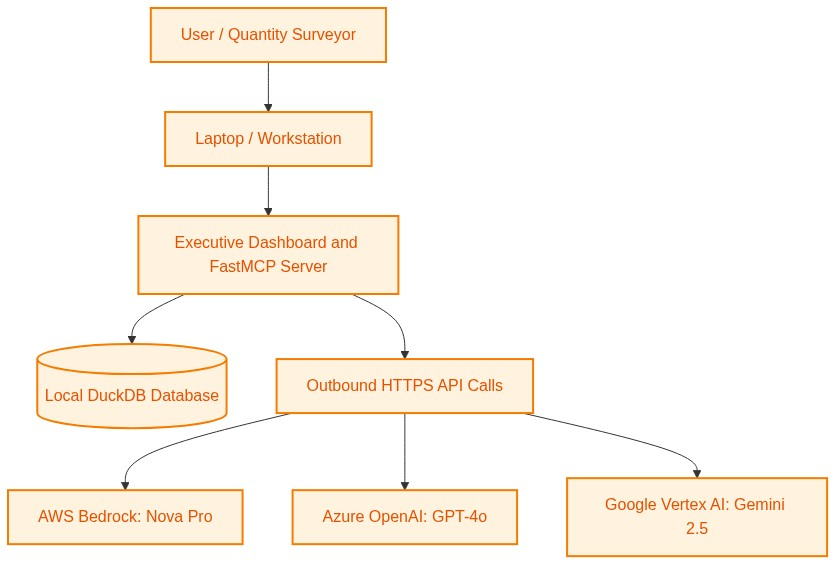

Approach 2 couples the local FastMCP deterministic calculation engine with managed cloud foundation model endpoints (Google Vertex AI, Amazon Bedrock, Azure OpenAI) for cognitive evaluation of non-confidential tender benchmark datasets.

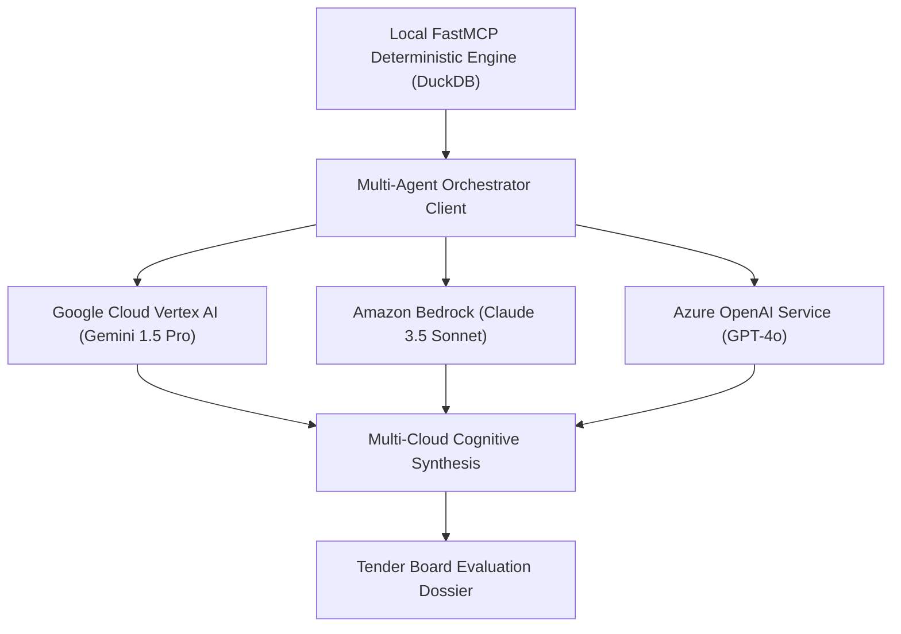
```mermaid
graph TD
    A["Local FastMCP Deterministic Engine (DuckDB)"] --> B["Multi-Agent Orchestrator Client"]
    B --> C1["Google Cloud Vertex AI (Gemini 1.5 Pro)"]
    B --> C2["Amazon Bedrock (Claude 3.5 Sonnet)"]
    B --> C3["Azure OpenAI Service (GPT-4o)"]
    C1 --> D["Multi-Cloud Cognitive Synthesis"]
    C2 --> D
    C3 --> D
    D --> E["Tender Board Evaluation Dossier"]
```

### <span id="hybrid-env"></span>🔑 4.1 Cloud LLM Provider Credentials & Environment (.env) <span style="font-size: 14px; font-weight: normal;">[⬆️ Back to TOC](#toc)</span>

Configure your enterprise cloud provider API keys in `.env`:

```bash
# Ensure you are at the S02_Agentic_Bid_Evaluation_And_Tender_Intelligence module root folder before starting
cd "${ACIP_MODULE_DEFAULT_FOLDER}"

# Amazon Bedrock
AWS_REGION="ap-southeast-1"
AWS_ACCESS_KEY_ID="${AWS_ACCESS_KEY}"
AWS_SECRET_ACCESS_KEY="${AWS_SECRET_KEY}"

# Azure OpenAI
AZURE_OPENAI_ENDPOINT="${AZURE_OPENAI_URL}"
AZURE_OPENAI_API_KEY="${AZURE_OPENAI_KEY}"

# Google Cloud Vertex AI
GCP_PROJECT_ID="${GCP_PROJECT_ID}"
GOOGLE_APPLICATION_CREDENTIALS="${PATH_TO_GCP_KEYFILE}"
```

### <span id="hybrid-dashboard"></span>📊 4.2 Cloud-Backed Executive Analytical Dashboard (AWS, Azure, GCP) <span style="font-size: 14px; font-weight: normal;">[⬆️ Back to TOC](#toc)</span>

Launch the Executive Analytical Dashboard configured with your active cloud cognitive engine:

```bash
# Ensure you are at the S02_Agentic_Bid_Evaluation_And_Tender_Intelligence module root folder before starting
cd "${ACIP_MODULE_DEFAULT_FOLDER}"
set -a; source .env; set +a

# 1. Launch with Amazon Web Services Engine (AWS Bedrock)
CLOUD_PROVIDER=AWS python3 dashboard/server.py

# 2. Launch with Microsoft Azure Engine (Azure OpenAI)
CLOUD_PROVIDER=AZURE python3 dashboard/server.py

# 3. Launch with Google Cloud Platform Engine (Vertex AI)
CLOUD_PROVIDER=GCP python3 dashboard/server.py

# 4. Launch with Local Sovereign Engine
CLOUD_PROVIDER=LOCAL python3 dashboard/server.py
```

📝 Note: Though there are 4 engines provided for you to run the Dashboard, you can only use one of the engine option at a time.

Open `http://localhost:8085` in any standard web browser to view the interactive dashboard with the active cloud cognitive engine badge (`AWS Engine`, `Azure Engine`, or `GCP Engine`) dynamically displayed in the top-right command bar.

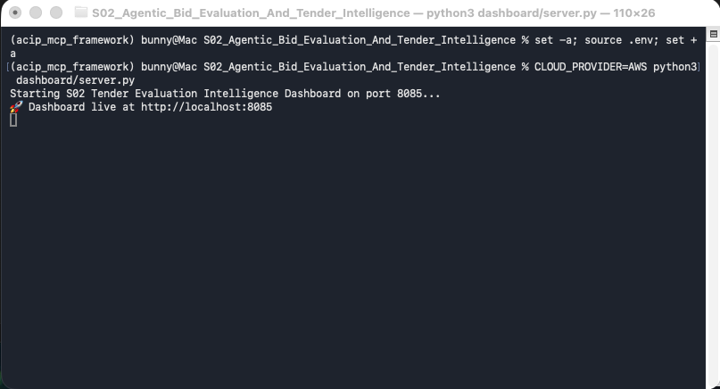

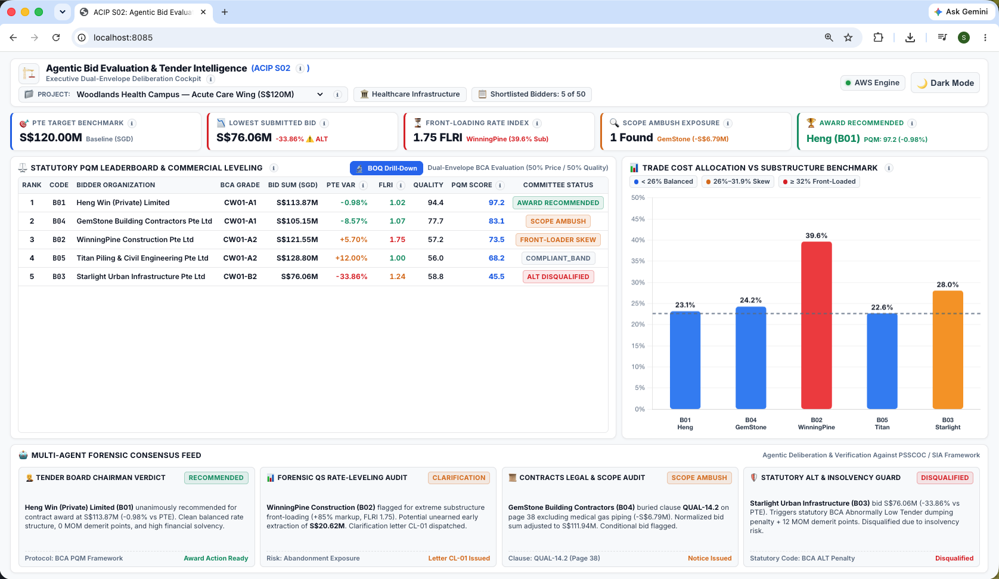

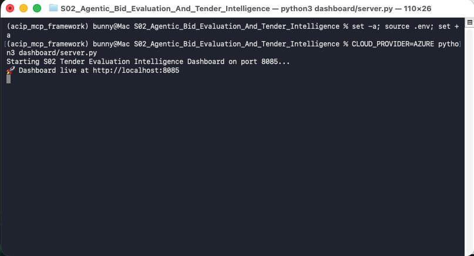

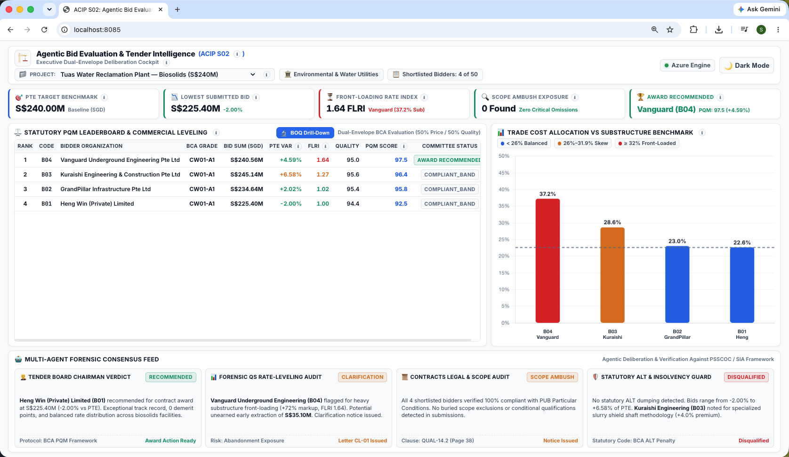


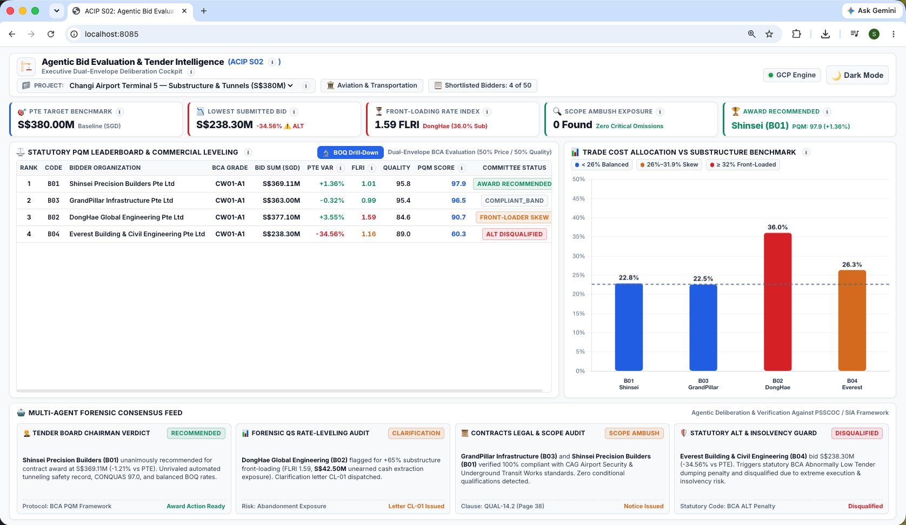


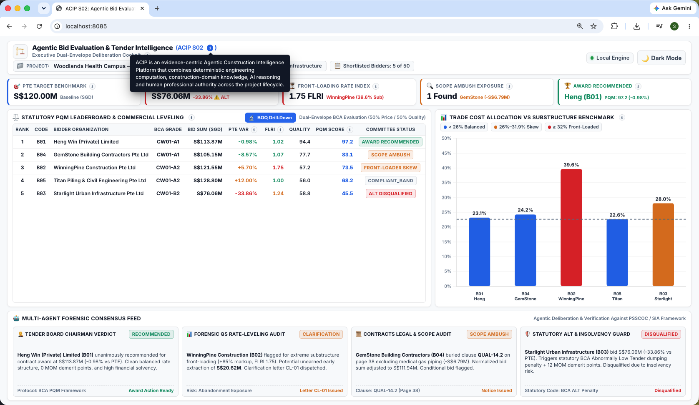

---

## <span id="cloud-provisioning"></span><span style="color:red">🌐 5. Approach 3: Cloud Workload Direct Provisioning (Multi-Cloud Terraform Deployments)</span> <span style="font-size: 14px; font-weight: normal;">[⬆️ Back to TOC](#toc)</span>

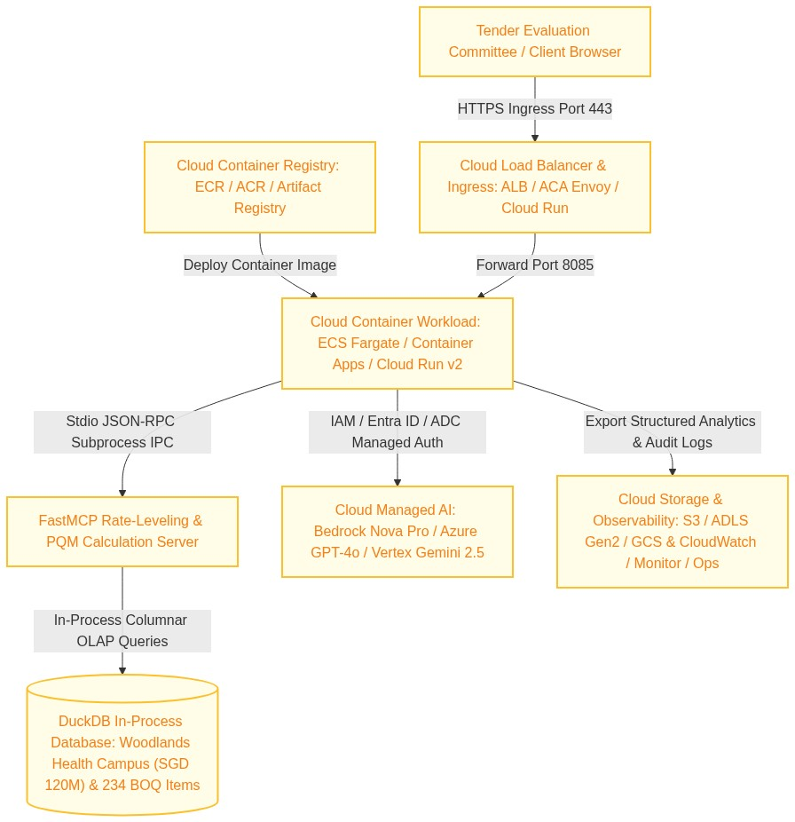

Approach 3 packages the entire S02 analytical suite (Executive Dashboard, FastMCP server, multi-agent evaluation client, and DuckDB columnar database) into a production Docker container, pushes it to your cloud container registry, and deploys it serverlessly using Terraform Infrastructure as Code (IaC).

📝 Security & Governance Notice: The Approach 3 cloud endpoints provisioned in this reference implementation are dedicated sandbox demonstration environments operating strictly on synthetic, non-confidential benchmark data. Production enterprise deployments handling confidential commercial tenders mandate private VPC ingress, Web Application Firewall (WAF) filtering, and OAuth2/OIDC IAM authentication gateways.

### <span id="why-cloud-native"></span>💡 5.1 Why Choose Cloud Workload Direct Provisioning? <span style="font-size: 14px; font-weight: normal;">[⬆️ Back to TOC](#toc)</span>
- **Production Availability**: Provides a persistent, publicly accessible HTTPS endpoint backed by cloud load balancers or edge ingresses.
- **Enterprise Security**: Integrates with native cloud IAM roles, Azure Entra ID Managed Identities, and Google Service Accounts with zero hardcoded API keys in runtime containers.
- **Serverless Autoscaling**: Scales compute resources dynamically based on incoming tender evaluation requests, scaling down to zero when idle (on Azure and GCP).

### <span id="cloud-native-prerequisites"></span>📋 5.2 Pre-requisites for Approach 3 <span style="font-size: 14px; font-weight: normal;">[⬆️ Back to TOC](#toc)</span>
- Docker Desktop running locally to build multi-platform container images.
- Terraform CLI installed.
- Cloud CLI authenticated to your cloud account (`aws configure`, `az login`, or `gcloud auth login`).

To package the S02 suite into a container and deploy serverlessly to the cloud, select your target Cloud Service Provider (CSP) track below:

---

### <span id="terraform-aws"></span>☁️ 5.3 AWS Deployment (ECS Fargate + Amazon Bedrock) <span style="font-size: 14px; font-weight: normal;">[⬆️ Back to TOC](#toc)</span>

<details>
<summary><b>🚀 Click to expand 5.3 AWS Deployment (ECS Fargate + Amazon Bedrock) guide, Terraform IaC, and architecture</b></summary>

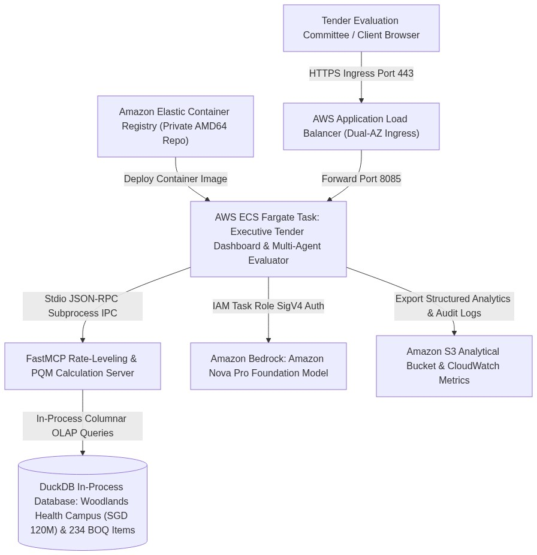

Provisions an AWS Application Load Balancer (ALB), an ECS Fargate serverless cluster, an ECR container repository, an IAM task execution role, and a secure S3 Medallion analytical storage bucket:

```bash
# Ensure you are at the S02_Agentic_Bid_Evaluation_And_Tender_Intelligence module root folder before starting
cd "${ACIP_MODULE_DEFAULT_FOLDER}"
set -a; source .env; set +a

# 1. Provision AWS Cloud Infrastructure via Terraform
terraform -chdir=terraform/aws init
terraform -chdir=terraform/aws apply -auto-approve

# 2. Build and Push Container Image to Amazon ECR
ECR_URL=$(terraform -chdir=terraform/aws output -raw ecr_repository_url)
ECR_REGION=$(echo ${ECR_URL} | cut -d'.' -f4)
aws ecr get-login-password --region ${ECR_REGION} | docker login --username AWS --password-stdin ${ECR_URL}
docker build --platform linux/amd64 -t acip-s02-tender-engine .
docker tag acip-s02-tender-engine:latest ${ECR_URL}:latest
docker push ${ECR_URL}:latest

# 3. Access Live Web Dashboard via AWS Application Load Balancer
ALB_URL=$(terraform -chdir=terraform/aws output -raw alb_url)

# Wait approximately 60 seconds (1 minute) for AWS ECS Fargate to pull the image and pass ALB health checks.
# Open the live AWS Web Dashboard in your default browser:
open ${ALB_URL}
```

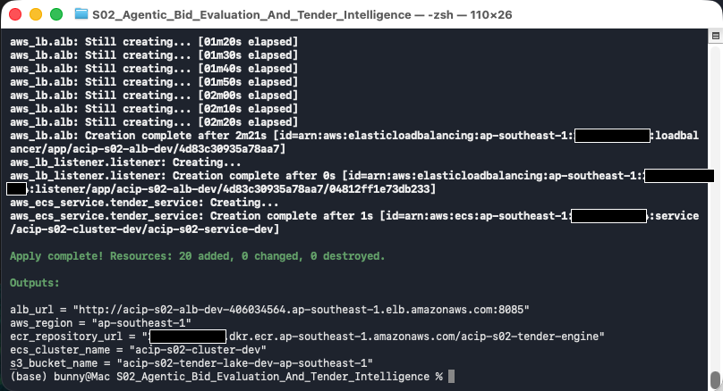

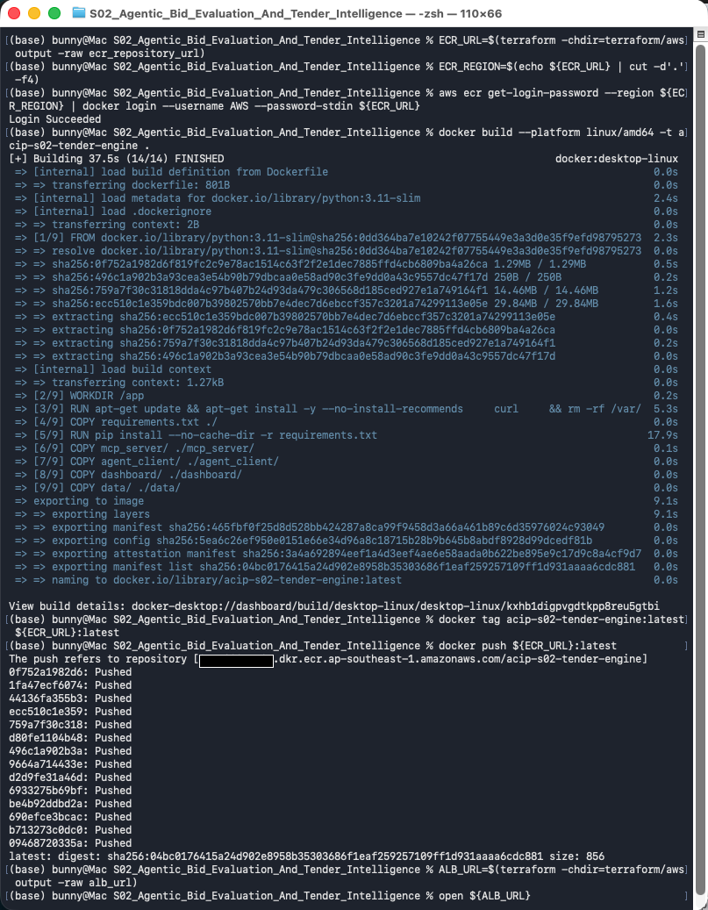

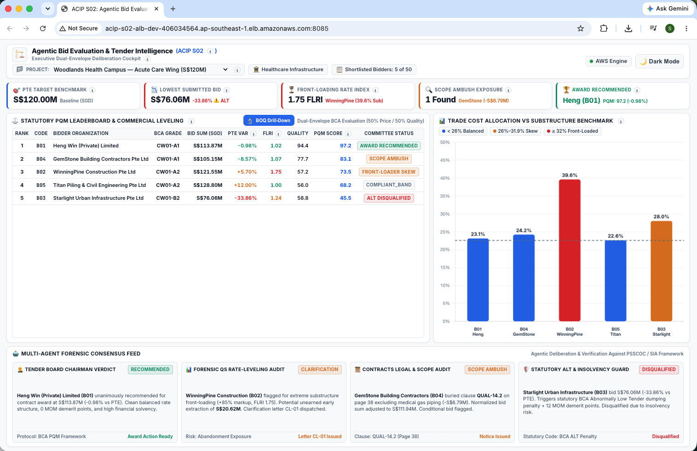

</details>

---

### <span id="terraform-azure"></span>🔷 5.4 Azure Deployment (Azure Container Apps + Azure OpenAI) <span style="font-size: 14px; font-weight: normal;">[⬆️ Back to TOC](#toc)</span>

<details>
<summary><b>🚀 Click to expand 5.4 Azure Deployment (Azure Container Apps + Azure OpenAI) guide, Terraform IaC, and architecture</b></summary>

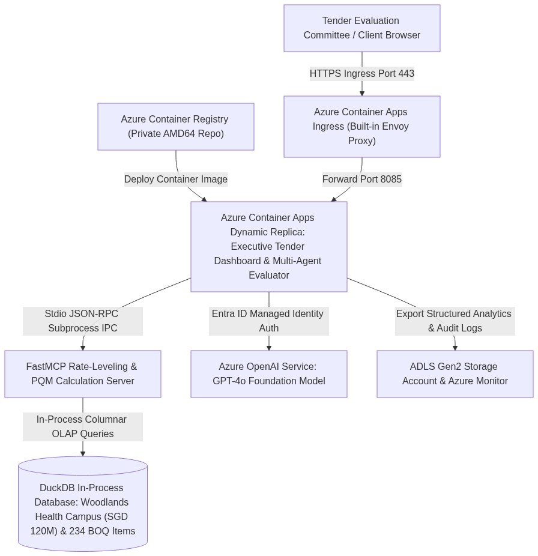

Provisions an Azure Container App environment, an Azure Container Registry (ACR), and an ADLS Gen2 hierarchical namespace storage account for big data tender analytics:

```bash
# Ensure you are at the S02_Agentic_Bid_Evaluation_And_Tender_Intelligence module root folder before starting
cd "${ACIP_MODULE_DEFAULT_FOLDER}"
set -a; source .env; set +a

# 1. Provision Azure Container Apps & ACR Infrastructure via Terraform
terraform -chdir=terraform/azure init
terraform -chdir=terraform/azure apply -auto-approve

# 2. Build and Push Container Image to Azure Container Registry (ACR)
ACR_LOGIN_SERVER=$(terraform -chdir=terraform/azure output -raw acr_login_server)
az acr login --name $(echo ${ACR_LOGIN_SERVER} | cut -d'.' -f1)
docker build --platform linux/amd64 -t acip-s02-tender-engine .
docker tag acip-s02-tender-engine:latest ${ACR_LOGIN_SERVER}/tender-engine:latest
docker push ${ACR_LOGIN_SERVER}/tender-engine:latest

# 3. Deploy Image to Azure Container Apps
RESOURCE_GROUP=$(terraform -chdir=terraform/azure output -raw resource_group_name)
az containerapp update \
  --name acip-s02-engine-dev \
  --resource-group ${RESOURCE_GROUP} \
  --image ${ACR_LOGIN_SERVER}/tender-engine:latest

# 4. Access Live Cloud Web Dashboard
CONTAINER_APP_FQDN=$(terraform -chdir=terraform/azure output -raw container_app_fqdn)

# Open the live Azure Container App Web Dashboard in your browser:
open https://${CONTAINER_APP_FQDN}
```

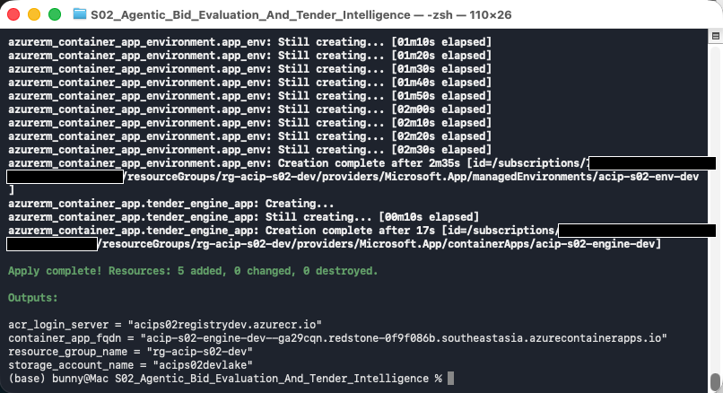

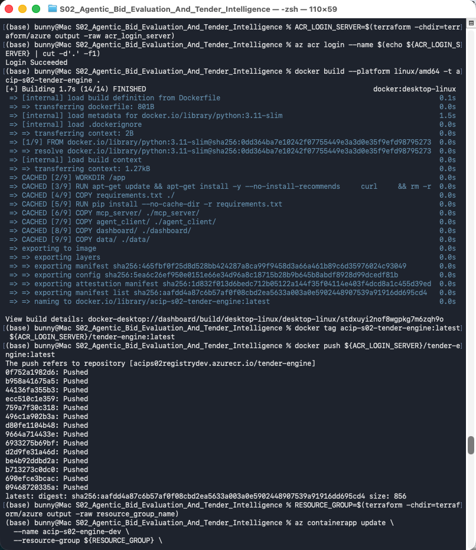

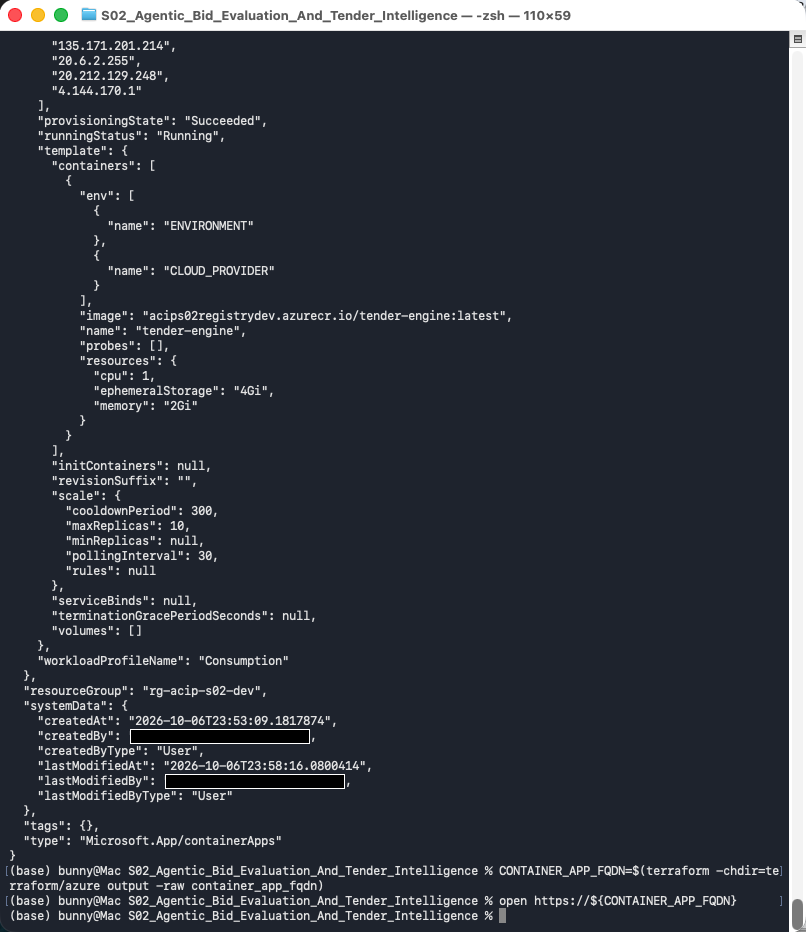


</details>

---

### <span id="terraform-gcp"></span>🌐 5.5 Google Cloud Deployment (Google Cloud Run + Vertex AI) <span style="font-size: 14px; font-weight: normal;">[⬆️ Back to TOC](#toc)</span>

<details>
<summary><b>🚀 Click to expand 5.5 Google Cloud Deployment (Google Cloud Run + Vertex AI) guide, Terraform IaC, and architecture</b></summary>

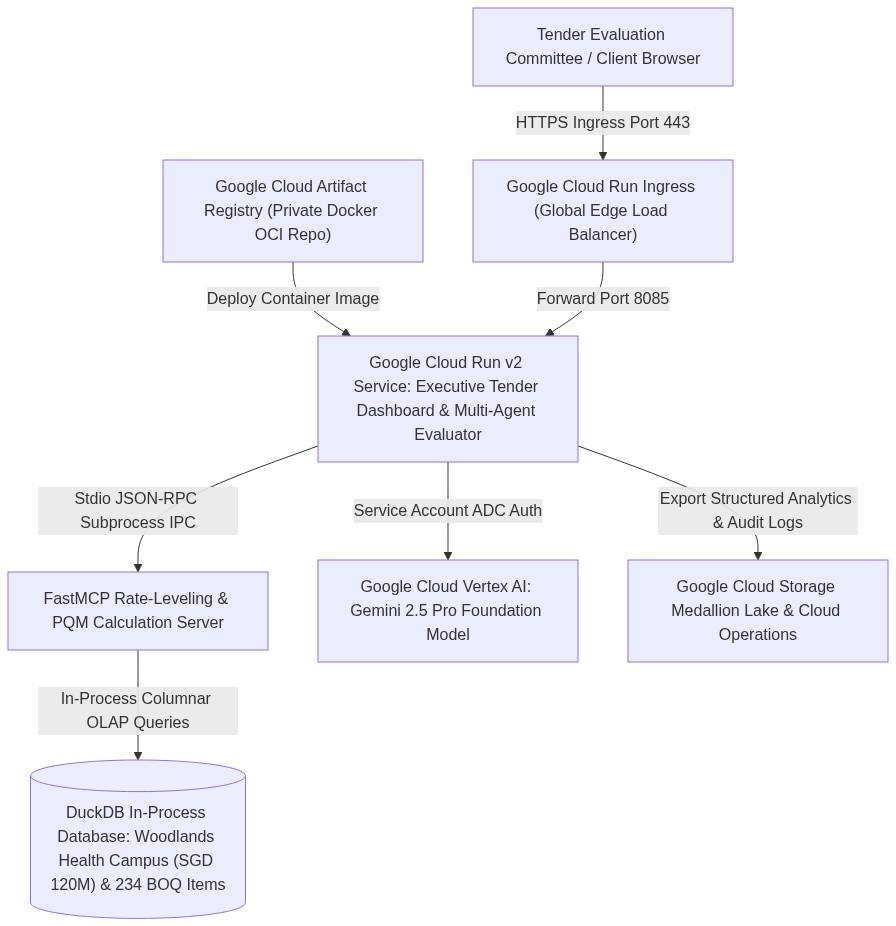

Provisions an autoscaling Google Cloud Run service connected to a Cloud Storage Medallion data lake bucket with versioning and lifecycle policies:

```bash
# Ensure you are at the S02_Agentic_Bid_Evaluation_And_Tender_Intelligence module root folder before starting
cd "${ACIP_MODULE_DEFAULT_FOLDER}"
set -a; source .env; set +a

# 1. Provision Google Cloud Run & Artifact Registry via Terraform
terraform -chdir=terraform/gcp init
terraform -chdir=terraform/gcp apply -auto-approve -var="project_id=${GCP_PROJECT_ID}"

# 2. Build and Push Container Image to Google Artifact Registry (GAR)
AR_REPO=$(terraform -chdir=terraform/gcp output -raw artifact_registry_repo)
gcloud auth configure-docker asia-southeast1-docker.pkg.dev --quiet
docker build --platform linux/amd64 --provenance=false -t acip-s02-tender-engine .
docker tag acip-s02-tender-engine:latest ${AR_REPO}/engine:latest
docker push ${AR_REPO}/engine:latest

# 3. Deploy Image to Google Cloud Run
gcloud run deploy acip-s02-tender-engine-dev \
  --image ${AR_REPO}/engine:latest \
  --region asia-southeast1 \
  --quiet

# 4. Access Live Cloud Web Dashboard
CLOUD_RUN_URL=$(terraform -chdir=terraform/gcp output -raw cloud_run_service_url)

# Open the live Google Cloud Run Web Dashboard in your browser:
open ${CLOUD_RUN_URL}
```

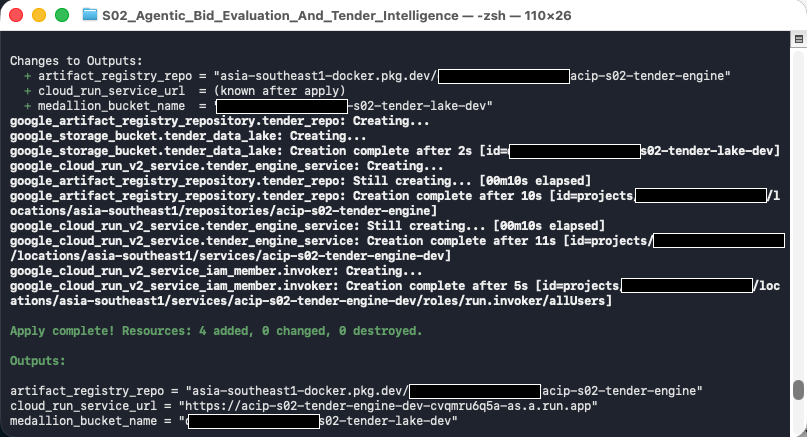

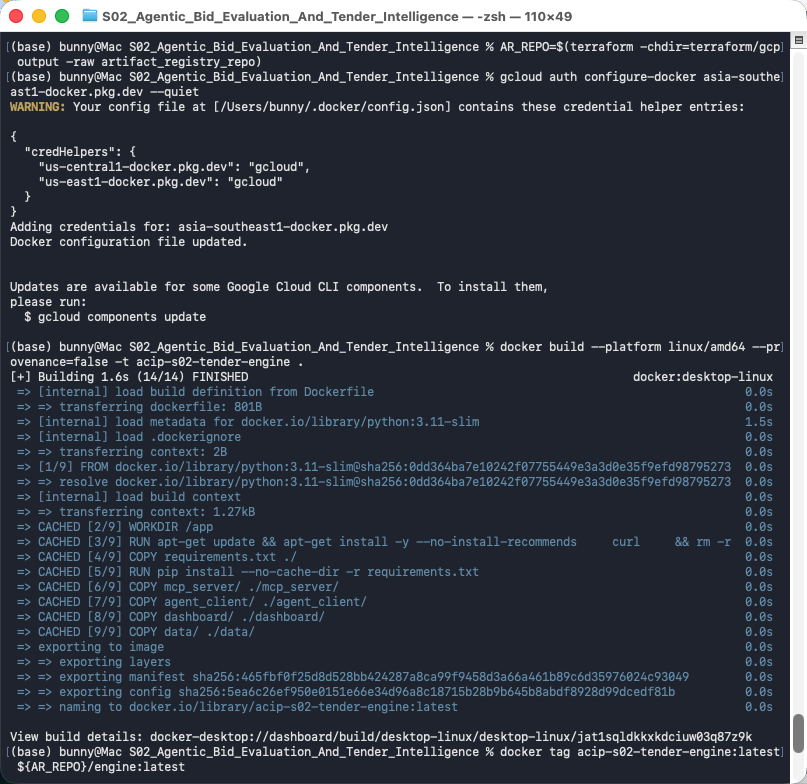

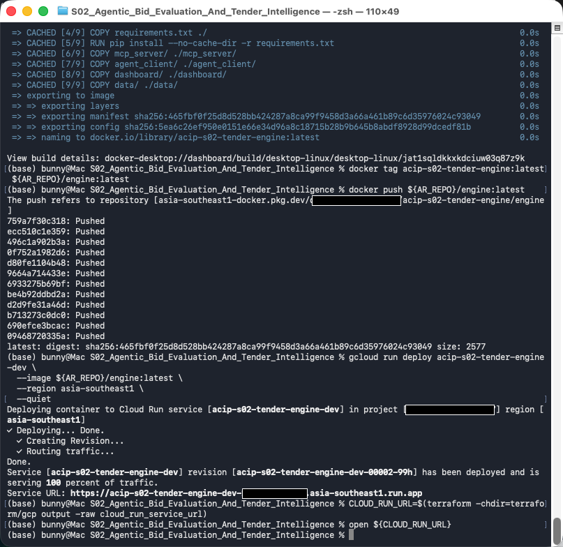

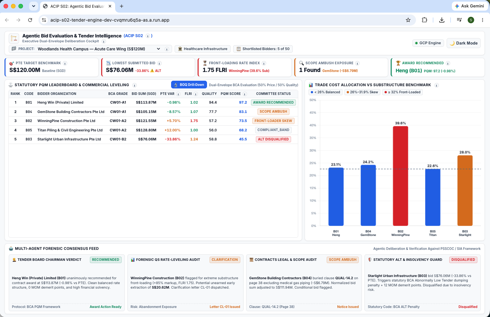

</details>

---

## <span id="enterprise-landing-zone"></span><span style="color:red">🏢 6. Approach 4: Enterprise Multi-Account Landing Zone & Sovereign Governance (Planned)</span> <span style="font-size: 14px; font-weight: normal;">[⬆️ Back to TOC](#toc)</span>

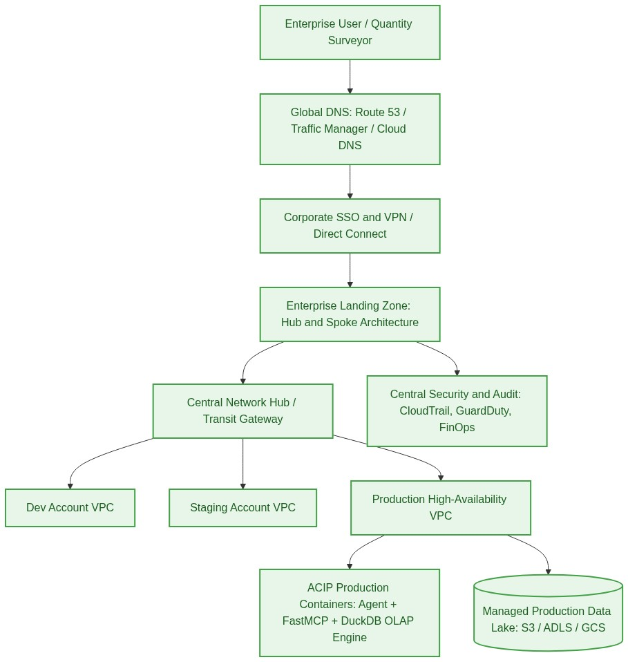

Approach 4 represents an architectural design blueprint and reference enterprise governance pattern rather than executable code in this repository. While Approaches 1, 2, and 3 provide working code, automated test suites, and deployable Terraform scripts, Approach 4 documents the target enterprise landing-zone topology (multi-account hierarchy, organizational guardrails, centralized hub-and-spoke networking, and sovereign CISO controls) for institutional and public-sector procurement environments. For public sector healthcare and major commercial infrastructure developments, tender evaluations involve commercially sensitive pricing and intellectual property that cannot be hosted on shared infrastructure.

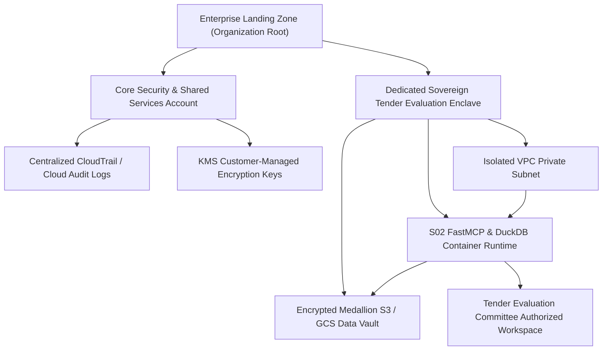
```mermaid
graph TD
    A["Enterprise Landing Zone (Organization Root)"] --> B["Core Security & Shared Services Account"]
    A --> C["Dedicated Sovereign Tender Evaluation Enclave"]
    B --> B1["Centralized CloudTrail / Cloud Audit Logs"]
    B --> B2["KMS Customer-Managed Encryption Keys"]
    C --> C1["Isolated VPC Private Subnet"]
    C --> C2["S02 FastMCP & DuckDB Container Runtime"]
    C --> C3["Encrypted Medallion S3 / GCS Data Vault"]
    C1 --> C2
    C2 --> C3
    C2 --> D["Tender Evaluation Committee Authorized Workspace"]
```

### <span id="tender-enclaves"></span>🛡️ 6.1 Dedicated Sovereign Tender Enclaves & Network Isolation <span style="font-size: 14px; font-weight: normal;">[⬆️ Back to TOC](#toc)</span>
- **Zero-Egress Private Subnets**: S02 container runtimes execute within isolated VPC private subnets with no direct outbound internet routes, preventing data leakage during tender deliberation.
- **Customer-Managed Encryption Keys (CMEK)**: All contractor pricing submissions, DuckDB files, and evaluation memos are encrypted using hardware security module (HSM) keys governed by the procuring authority.

### <span id="audit-rbac"></span>⚖️ 6.2 Audit Trails, RBAC & Statutory Tender Board Compliance <span style="font-size: 14px; font-weight: normal;">[⬆️ Back to TOC](#toc)</span>
- **Immutable Audit Logging**: Every query executed against the DuckDB database and every parameter passed to FastMCP tools is recorded to write-once-read-many (WORM) storage.
- **Strict Role-Based Access Control (RBAC)**: Only appointed members of the Tender Evaluation Committee and authorized Quantity Surveyors hold cryptographic keys to access the tender workspace. All model outputs require formal human sign-off prior to contract award.

---

## <span id="automated-testing"></span><span style="color:red">🧪 7. Automated Testing & Verification</span> <span style="font-size: 14px; font-weight: normal;">[⬆️ Back to TOC](#toc)</span>

Execute the automated test suite verifying schema integrity, Z-score outlier detection, front-loading flags, scope exclusions, PQM scoring, and multi-agent deliberation:

```bash
# Ensure you are at the S02_Agentic_Bid_Evaluation_And_Tender_Intelligence module root folder before starting
cd "${ACIP_MODULE_DEFAULT_FOLDER}"
python3 -m unittest tests/test_s02_pipeline.py -v
```

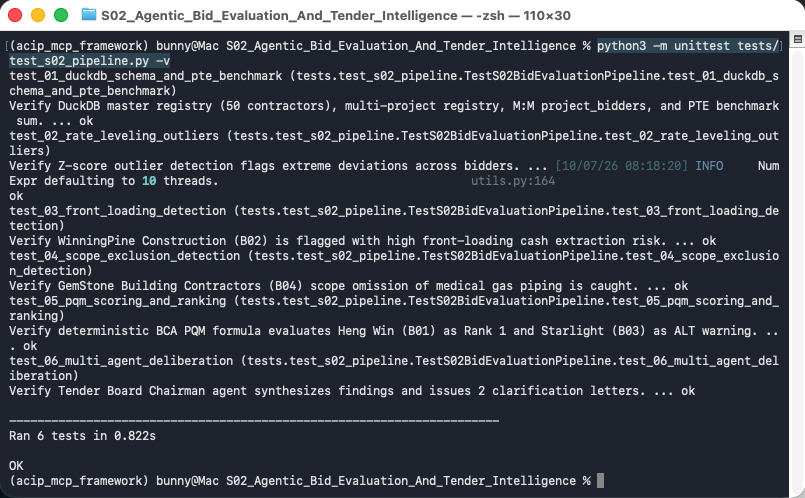

---

## <span id="cleanup"></span><span style="color:red">🧹 8. Clean Up</span> <span style="font-size: 14px; font-weight: normal;">[⬆️ Back to TOC](#toc)</span>

To tear down provisioned cloud infrastructure and reset local database state:

### 8.1 Destroy Cloud Workloads (AWS, Azure, GCP)

If you deployed cloud resources in Approach 3, destroy them to avoid ongoing provider charges:

```bash
# Ensure you are at the S02_Agentic_Bid_Evaluation_And_Tender_Intelligence module root folder before starting
cd "${ACIP_MODULE_DEFAULT_FOLDER}"
set -a; source .env; set +a

# 1. Destroy Amazon Web Services Infrastructure
terraform -chdir=terraform/aws destroy -auto-approve

# 2. Destroy Microsoft Azure Infrastructure
terraform -chdir=terraform/azure destroy -auto-approve

# 3. Destroy Google Cloud Platform Infrastructure
terraform -chdir=terraform/gcp destroy -auto-approve -var="project_id=${GCP_PROJECT_ID}"
```

### 8.2 Reset Local Database & Test Artifacts

To remove the local DuckDB database file and synthetic bidder submissions:

```bash
# Ensure you are at the S02_Agentic_Bid_Evaluation_And_Tender_Intelligence module root folder before starting
cd "${ACIP_MODULE_DEFAULT_FOLDER}"
rm -f data/hospital_tender.duckdb
rm -rf data/tender_submissions/*.json
```

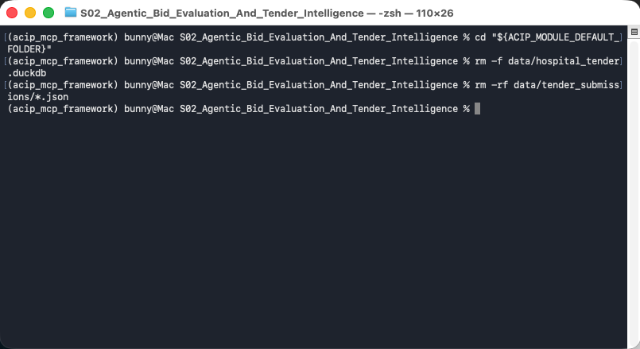

---

## 📄 License
This module is distributed as part of the Agentic Construction Intelligence Platform (ACIP) under the **Apache License 2.0**. See the root [LICENSE](../LICENSE) file for full license terms and conditions.
