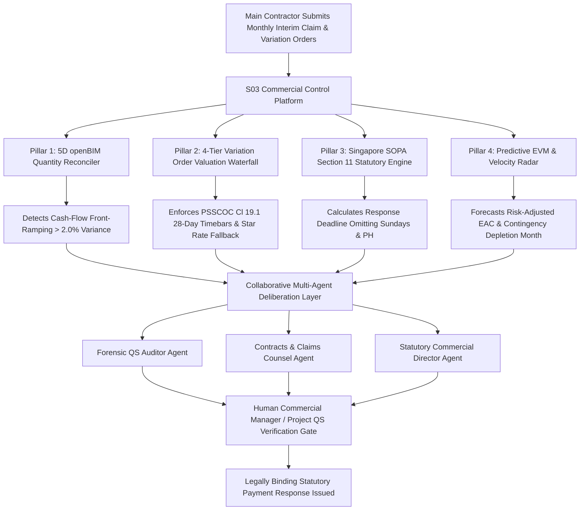

# ACIP S03: Commercial Control & Statutory Analytical Pillars Workflow Architecture

```mermaid
graph TD
    A["Main Contractor Submits Monthly Interim Claim & Variation Orders"] --> B["S03 Commercial Control Platform"]
    B --> C["Pillar 1: 5D openBIM Quantity Reconciler"]
    B --> D["Pillar 2: 4-Tier Variation Order Valuation Waterfall"]
    B --> E["Pillar 3: Singapore SOPA Section 11 Statutory Engine"]
    B --> F["Pillar 4: Predictive EVM & Velocity Radar"]
    C --> G["Detects Cash-Flow Front-Ramping > 2.0% Variance"]
    D --> H["Enforces PSSCOC Cl 19.1 28-Day Timebars & Star Rate Fallback"]
    E --> I["Calculates Response Deadline Omitting Sundays & PH"]
    F --> J["Forecasts Risk-Adjusted EAC & Contingency Depletion Month"]
    G --> K["Collaborative Multi-Agent Deliberation Layer"]
    H --> K
    I --> K
    J --> K
    K --> L["Forensic QS Auditor Agent"]
    K --> M["Contracts & Claims Counsel Agent"]
    K --> N["Statutory Commercial Director Agent"]
    L --> O["Human Commercial Manager / Project QS Verification Gate"]
    M --> O
    N --> O
    O --> P["Legally Binding Statutory Payment Response Issued"]
```
