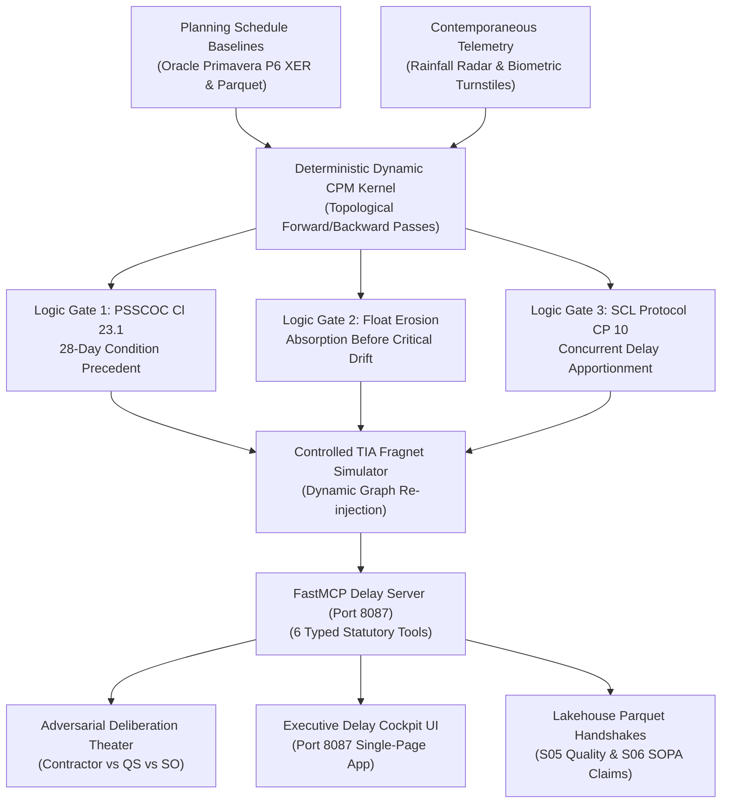

```mermaid
graph TD
    A["Planning Schedule Baselines<br/>(Oracle Primavera P6 XER & Parquet)"] --> B["Deterministic Dynamic CPM Kernel<br/>(Topological Forward/Backward Passes)"]
    T["Contemporaneous Telemetry<br/>(Rainfall Radar & Biometric Turnstiles)"] --> B
    B --> C1["Logic Gate 1: PSSCOC Cl 23.1<br/>28-Day Condition Precedent"]
    B --> C2["Logic Gate 2: Float Erosion<br/>Absorption Before Critical Drift"]
    B --> C3["Logic Gate 3: SCL Protocol CP 10<br/>Concurrent Delay Apportionment"]
    C1 --> D["Controlled TIA Fragnet Simulator<br/>(Dynamic Graph Re-injection)"]
    C2 --> D
    C3 --> D
    D --> E["FastMCP Delay Server (Port 8087)<br/>(6 Typed Statutory Tools)"]
    E --> F1["Adversarial Deliberation Theater<br/>(Contractor vs QS vs SO)"]
    E --> F2["Executive Delay Cockpit UI<br/>(Port 8087 Single-Page App)"]
    E --> F3["Lakehouse Parquet Handshakes<br/>(S05 Quality & S06 SOPA Claims)"]
```
